# 普通算子性能分析建模图解

## 🎯 目标

这份说明只覆盖 `address_remapping` 当前 **普通算子** 的性能分析主路径，不展开 `ring_gemm` 专用微流水路径。

它回答 5 个问题：

1. 请求是怎么从图和张量变成 `PhysicalRequest` 的？
2. 请求是怎么分配到多个 AG、多个 bank 的？
3. 每个 bank/controller 维护了哪些状态？
4. `RR` 切行、`RW` 切换、写回阻塞是怎么在模型里出现的？
5. 最后 `latency` 是怎么从 `compute / memory timeline / AG issue` 三类约束汇总出来的？

对应代码主干在：

- [performance.py](/H:/dev/projects/ndp-sim/address_remapping/src/address_remapping/performance.py)
- [BANK_CONTROLLER_COST_MODEL_RULES.md](/H:/dev/projects/ndp-sim/address_remapping/BANK_CONTROLLER_COST_MODEL_RULES.md)
- [GENERAL_OPERATOR_LATENCY_MODEL.md](/H:/dev/projects/ndp-sim/address_remapping/GENERAL_OPERATOR_LATENCY_MODEL.md)

---

## 🧭 总览图

下面这张图对应普通算子主路径的 5 层建模：

1. 图与张量解析
2. 地址请求物化
3. stream 级统计
4. 闭环 bank timeline
5. bound 汇总与 roofline 对照

```mermaid
flowchart LR
    accTitle: 普通算子性能分析总览
    accDescr: 从 graph 输入到请求物化、stream 统计、bank timeline、compute bound 和最终 latency 汇总的普通算子性能分析主链路。

    graph["📄 Graph / Tensors<br/>shape + dtype + base_addr<br/>mode = baseline / remap / interleave"]
    op["🧩 _analyze_op<br/>按输入端口遍历 op"]
    req["📦 PhysicalRequest 物化<br/>role + ag_id + bank,row,col"]
    stream["📊 Stream 级统计<br/>request_count / issue_cycles<br/>row_switch_penalty / adjusted_stream_cycles"]
    timeline["🏦 闭环 Bank Timeline<br/>多 bank ready queue + 两级仲裁 + 回压"]
    compute["🧮 Compute Bound<br/>_estimate_compute"]
    roof["📈 True Roofline<br/>ops / bytes"]
    merge["📌 普通算子 Latency 汇总<br/>max(compute, memory_timeline, ag_issue)"]
    report["📝 Performance JSON / MD<br/>bank_timeline + analytical_model + roofline"]

    graph --> op --> req --> stream
    req --> timeline
    op --> compute
    req --> roof
    stream --> merge
    timeline --> merge
    compute --> merge
    roof -. 理论上界对照 .-> merge
    merge --> report

    classDef source fill:#dbeafe,stroke:#2563eb,stroke-width:2px,color:#1e3a5f
    classDef process fill:#fef9c3,stroke:#ca8a04,stroke-width:2px,color:#713f12
    classDef core fill:#fee2e2,stroke:#dc2626,stroke-width:2px,color:#7f1d1d
    classDef output fill:#dcfce7,stroke:#16a34a,stroke-width:2px,color:#14532d

    class graph source
    class op,req,stream,compute,roof process
    class timeline,merge core
    class report output
```

---

## 🧱 请求物化：从 Tensor 到 `PhysicalRequest`

普通算子的请求生成入口在 `_analyze_op`：

- 输入端口：
  - `_classify_input_stream`
  - `_requests_from_edge_result` 或 `_requests_from_source_tensor`
- 输出端口：
  - `_requests_from_output_tensor`
- 然后统一进入 `PhysicalRequest`

### 1. 请求物化示意图

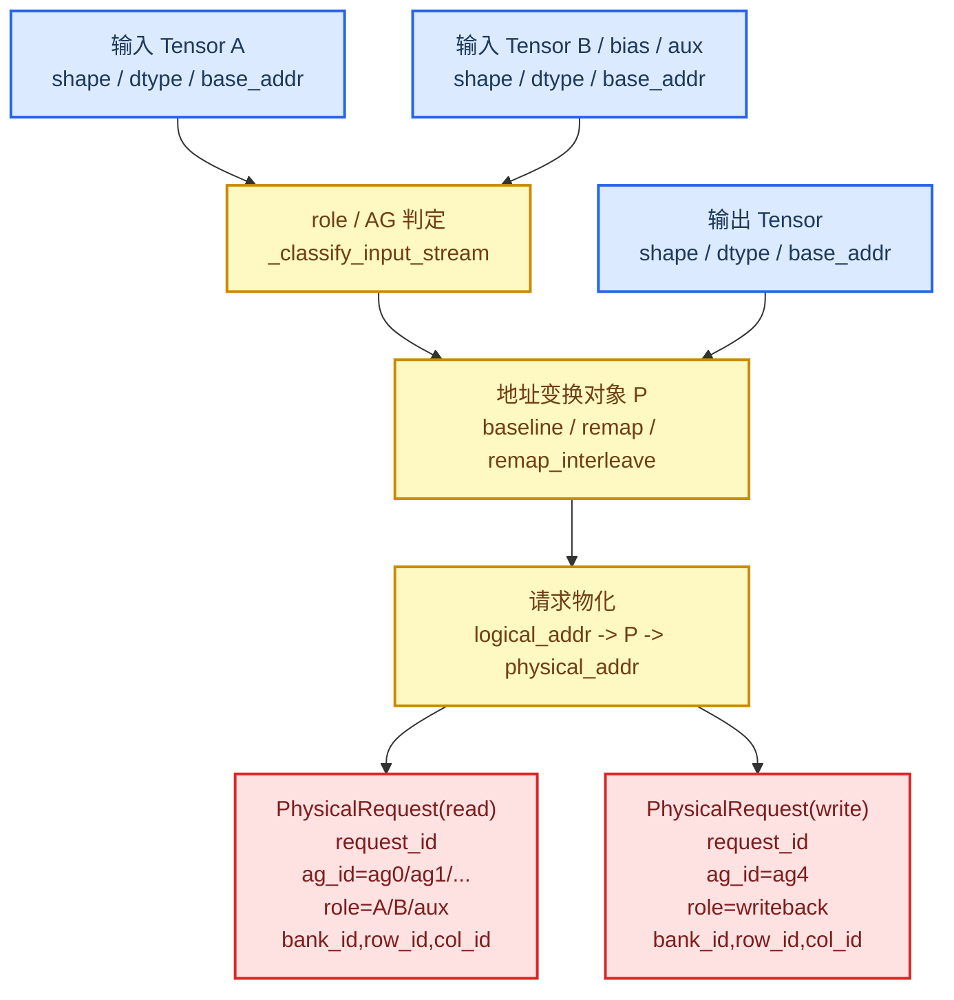

### 2. `PhysicalRequest` 里最关键的字段

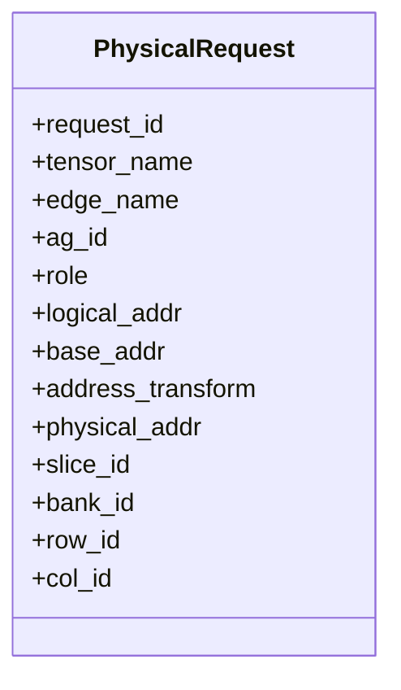

### 3. mode 影响的是哪一层

- `baseline`
  - 输入/输出按 identity transform 物化
- `remap`
  - 使用 solver 推导出的地址变换
- `remap_interleave`
  - 在 remap 基础上进一步把 bank 维度做 interleave

也就是说：

- **mode 改的是请求分布**
- 然后请求分布再去影响：
  - 哪些 bank 被激活
  - row hit / row miss 怎么出现
  - `RR` / `RW` 切换如何累积

---

## 🏦 多 Bank 请求分发：每个 Bank 维护什么

`_simulate_per_bank_timeline` 是普通算子建模的核心。  
它不是“把所有请求塞进一个静态大公式”，而是一个 **per-bank 状态 + 全局闭环推进** 的离散事件模型。

### 1. 4-bank 抽象布局图

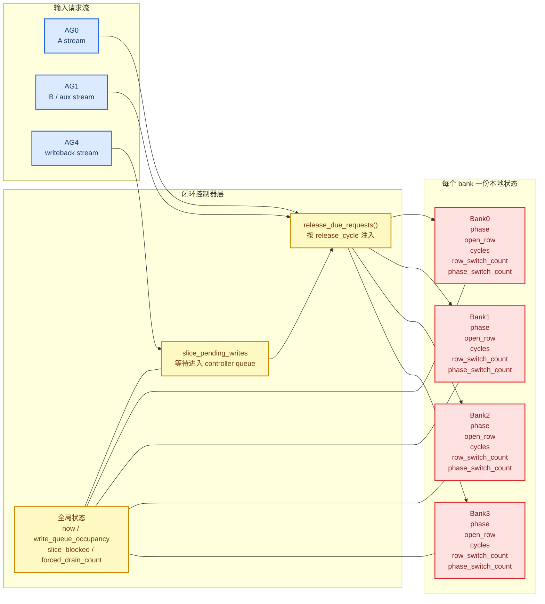

### 2. 模型里“全局状态”和“bank 本地状态”的分工

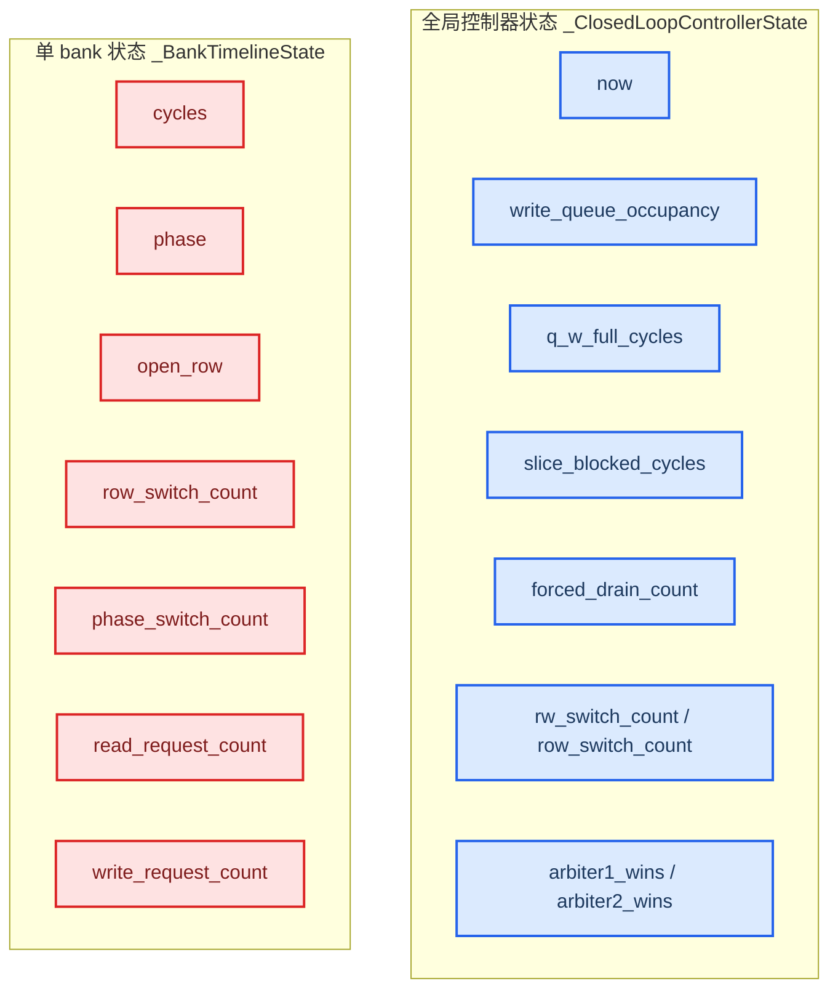

---

## 🔀 仲裁、切行、回压：闭环 Bank Timeline 到底怎么跑

这一层对应：

- `_bank_request_delta`
- `_apply_bank_request`
- `_simulate_per_bank_timeline`

### 1. 单 bank 的 row / phase 成本模型

这部分是切行和切换成本最核心的抽象：

- 初始第一次请求：
  - `request_latency_cycles`
- 同 `phase` 且同 `row`：
  - `bank_return_interval_cycles`
- 同 `phase` 但换 `row`：
  - `row_switch_penalty_cycles + bank_return_interval_cycles`
- `read <-> write` phase 切换：
  - 当前模型也记成 `row_switch_penalty_cycles + bank_return_interval_cycles`

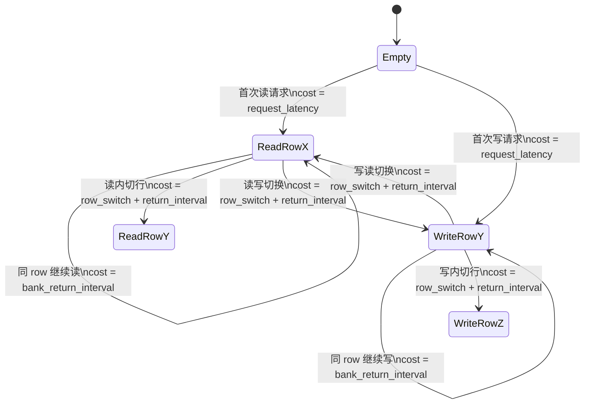

### 2. 两级仲裁规则：为什么会偏好 continuation traffic

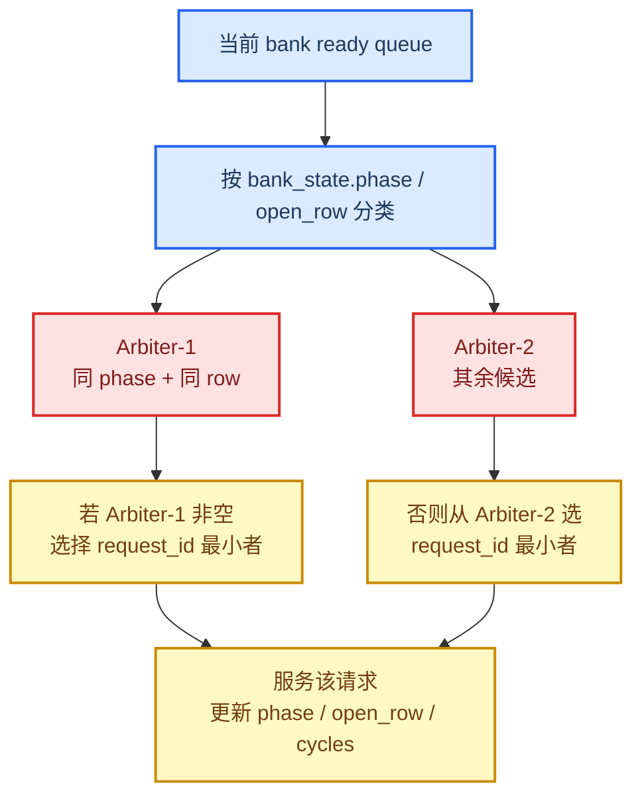

这就是为什么：

- 同一 row、同一 phase 的长串请求更容易持续被服务
- `RR` 连续命中很多时，`arbiter1_wins` 会很高
- 一旦 phase 或 row 频繁切换，`arbiter2_wins` 和切换惩罚就会升高

### 3. `RR` 切行和 `RW` 切换在模型里怎么出现

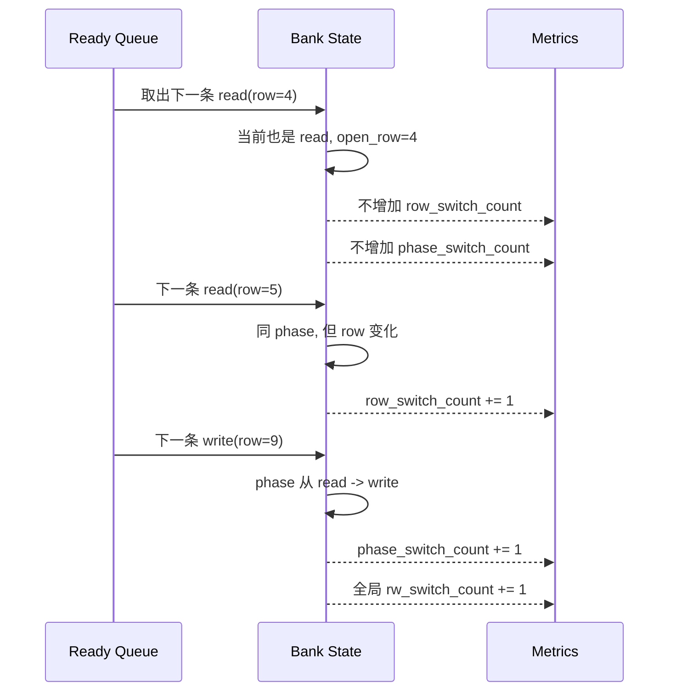

### 4. 写回回压为什么会反过来堵住读

这是普通算子模型和“纯静态 flat queue 模型”最大的区别之一。

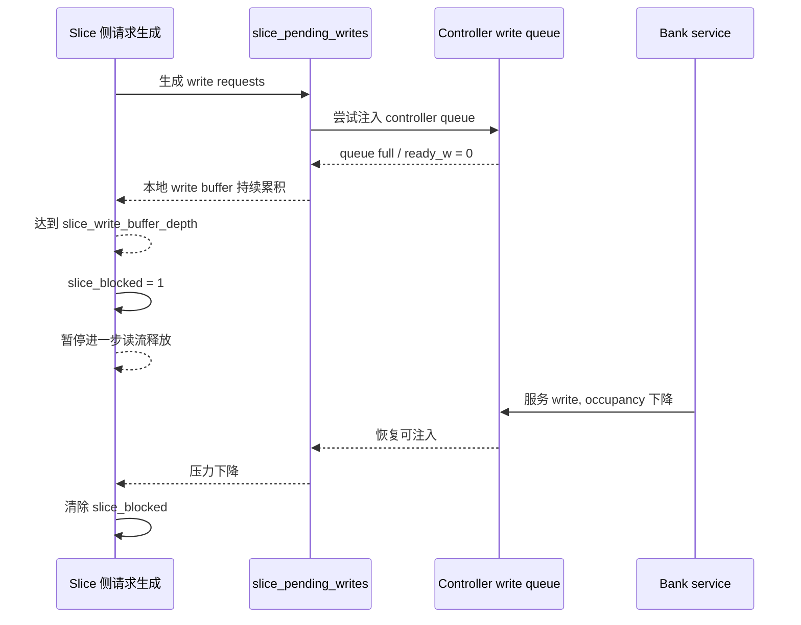

### 5. 回压状态机：什么时候进入 forced drain

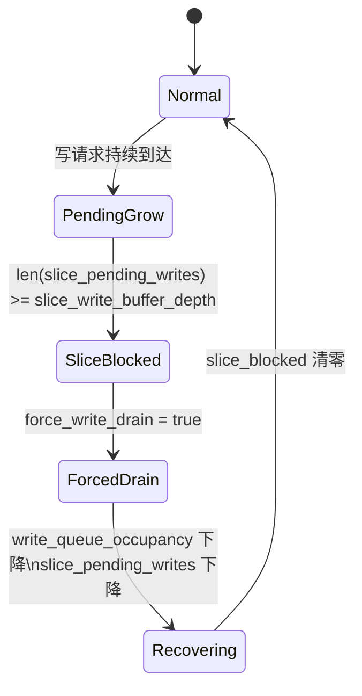

---

## 📐 Latency 是怎么汇总出来的

普通算子不走 ring-gemm 专用重叠公式，它的 latency 汇总非常直接：

```text
latency = max(compute_bound, memory_timeline_bound, ag_issue_bound)
```

### 1. 三类 bound 对比图

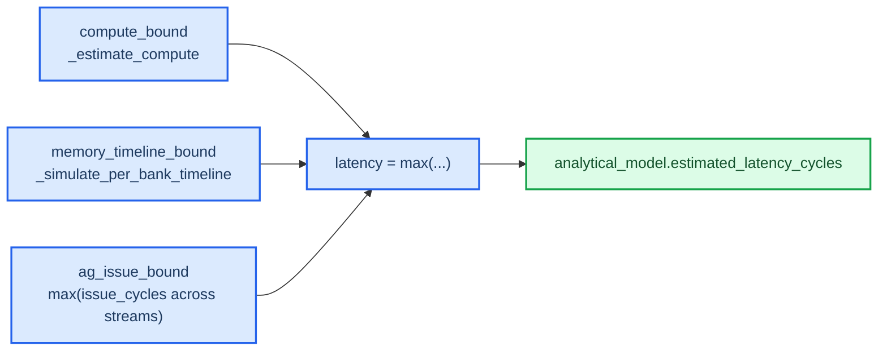

### 2. `compute_bound` 怎么估计

普通算子的 compute work 由 `_estimate_compute` 给出：

- `prefill_summac / prefill_sum_rec / prefill_max`
  - 近似为 reduction work
- `remote_sum`
  - 当前用 `output_elements` 近似
- 其他普通算子
  - 当前基本按 `output_elements` 近似

然后：

```text
compute_bound = ceil(op_work / general_peak_ops_per_cycle)
```

### 3. `true_roofline` 和行为级 timeline 的区别

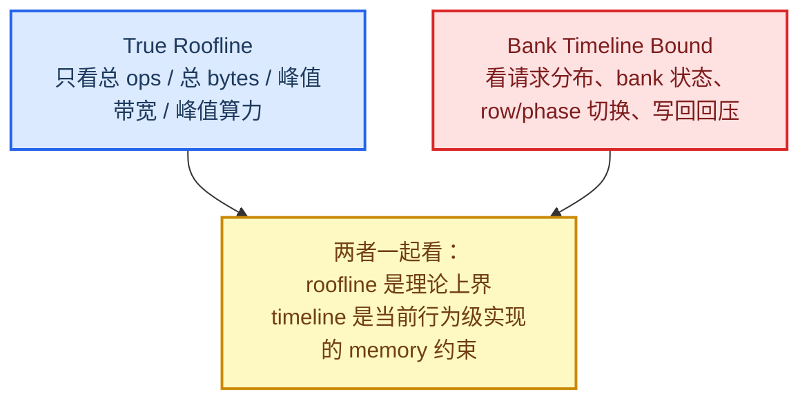

换句话说：

- `true_roofline`
  - 回答“如果只看总量，理论最好能多快”
- `bank_timeline`
  - 回答“考虑 bank 行为、切换、仲裁、写回压力后，这个普通算子在当前模型里会被 memory 约束到什么程度”

---

## 🧪 案例落地：以 `rmsnorm_mul_withbaseaddr` 为例

为了让上面的抽象图有落点，可以把 `rmsnorm_mul_withbaseaddr` 理解成下面这个请求图景：

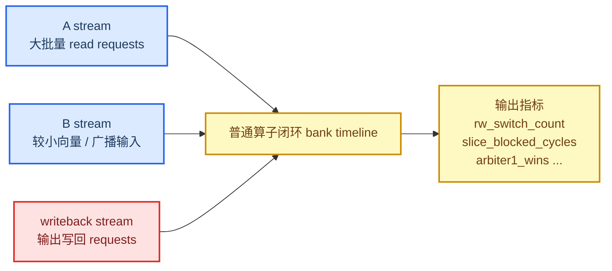

你在读这个 case 的 JSON 输出时，建议按这个顺序看：

1. `streams`
   - 每个 AG 流自己有多少请求、issue 多久
2. `bank_timeline`
   - 是否有大量 `rw_switch_count`
   - 是否有 `q_w_full_cycles / slice_blocked_cycles`
   - `arbiter1_wins` 是否远高于 `arbiter2_wins`
3. `analytical_model`
   - 到底是 `compute_bound`、`memory_timeline_bound` 还是 `ag_issue_bound` 在主导
4. `hardware_measured_cycles`
   - 看模型和硬件是总 latency 偏了，还是 trace 机制解释偏了

---

## 🗺️ 输出指标阅读图

下面这张图可以当成“拿到 performance.json 以后先看什么”的速查表。

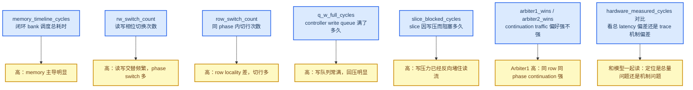

### 最后可以压缩成一句话

普通算子的性能分析不是一个单一公式，而是：

> **先把张量访问物化成带 `bank,row,col` 的请求，再用带两级仲裁和写回回压的闭环 bank timeline 计算 memory 行为，最后和 compute bound / AG issue bound 取最大值。**

---

## 📎 代码映射速查

| 主题 | 代码入口 |
| --- | --- |
| mode 级汇总 | `_analyze_mode` |
| 普通算子主入口 | `_analyze_op` |
| stream 统计 | `_build_stream_reports` |
| 单 bank 请求代价 | `_bank_request_delta` |
| bank 状态更新 | `_apply_bank_request` |
| 闭环 bank timeline | `_simulate_per_bank_timeline` |
| compute bound | `_estimate_compute` |
| true roofline | `_true_roofline_from_totals` |

这些图如果要继续往下细化，下一步最自然的扩展就是：

- 再单独画一份 `summac` / `mul` 的 trace 节奏对照图
- 或补一个“baseline vs remap_interleave 请求分布差异图”
