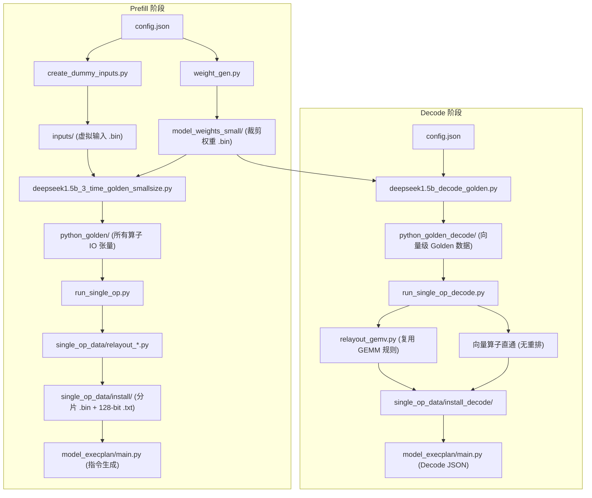
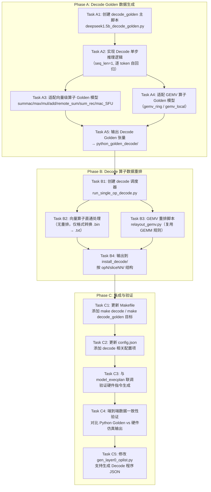

# Generate Python Golden — DeepSeek-1.5B Prefill / Decode 黄金数据生成与硬件适配工具

## 目录

- [Generate Python Golden — DeepSeek-1.5B Prefill / Decode 黄金数据生成与硬件适配工具](#generate-python-golden--deepseek-15b-prefill--decode-黄金数据生成与硬件适配工具)
  - [目录](#目录)
  - [概述](#概述)
  - [项目结构](#项目结构)
  - [整体流水线](#整体流水线)
  - [配置文件：`config.json`](#配置文件configjson)
  - [第一阶段：Python Golden 数据生成](#第一阶段python-golden-数据生成)
    - [`generate_seq_input.py`](#generate_seq_inputpy)
    - [`create_dummy_inputs.py`](#create_dummy_inputspy)
    - [`weight_gen.py`](#weight_genpy)
    - [`create_summac_data.py`](#create_summac_datapy)
    - [`deepseek1.5b_3_time_golden_smallsize.py`（主脚本）](#deepseek15b_3_time_golden_smallsizepy主脚本)
  - [第二阶段：单算子数据切片与重排](#第二阶段单算子数据切片与重排)
    - [`run_single_op.py`（调度器）](#run_single_oppy调度器)
    - [`single_op_data/` — 算子重排脚本详解](#single_op_data--算子重排脚本详解)
      - [`relayout_gemm.py` — GEMM 矩阵乘法重排](#relayout_gemmpy--gemm-矩阵乘法重排)
      - [`relayout_rmsnorm.py` — RMS Norm 重排](#relayout_rmsnormpy--rms-norm-重排)
      - [`relayout_softmax.py` — Softmax 重排](#relayout_softmaxpy--softmax-重排)
      - [`relayout_rope.py` — RoPE 重排](#relayout_ropepy--rope-重排)
      - [`relayout_layer0.py` — Layer0 批量调度](#relayout_layer0py--layer0-批量调度)
      - [`relayout_mul_MN_N_kv.py` — KV 投影专用 Mul 重排](#relayout_mul_mn_n_kvpy--kv-投影专用-mul-重排)
      - [`relayout_regular.py` — 通用逐元素算子重排](#relayout_regularpy--通用逐元素算子重排)
      - [`relayout_remote_sum.py` — 跨片归约重排](#relayout_remote_sumpy--跨片归约重排)
      - [`backup/` — 历史备份](#backup--历史备份)
  - [辅助文件说明](#辅助文件说明)
  - [使用方法](#使用方法)
    - [环境准备](#环境准备)
    - [一键执行完整流程（推荐）](#一键执行完整流程推荐)
    - [分步执行](#分步执行)
      - [Decode 阶段命令](#decode-阶段命令)
    - [自定义配置](#自定义配置)
  - [输出目录结构](#输出目录结构)
    - [文件命名规范](#文件命名规范)
  - [第三阶段：Decode 阶段 Golden 数据生成与重排（需要完成的）](#第三阶段decode-阶段-golden-数据生成与重排需要完成的)
    - [背景：Prefill vs Decode 的计算特征差异](#背景prefill-vs-decode-的计算特征差异)
    - [关键设计原则](#关键设计原则)
    - [已有 Decode 算子 JSON 清单](#已有-decode-算子-json-清单)
    - [Decode 阶段任务清单](#decode-阶段任务清单)
      - [详细任务分解](#详细任务分解)
        - [Phase A: Decode Golden 数据生成](#phase-a-decode-golden-数据生成)
        - [Phase B: Decode 算子数据重排](#phase-b-decode-算子数据重排)
        - [Phase C: 集成与验证](#phase-c-集成与验证)
    - [Decode 阶段新增文件规划](#decode-阶段新增文件规划)
    - [Decode 算子命名对照表](#decode-算子命名对照表)

---

## 概述

本工具集用于 **DeepSeek-R1-Distill-Qwen-1.5B** 大语言模型 **Prefill 阶段**和 **Decode 阶段**的黄金数据（Golden Data）生成，并支持按硬件内存布局对数据进行**切片（Slice）与重排（Relayout）**，以适配 NDP（Near-Data Processing）硬件仿真器的加载格式。

整个流水线分为三大阶段：

| 阶段 | 目标 | 核心产出 |
|------|------|----------|
| **第一阶段：Prefill Golden 生成** | 模拟单层 Transformer 的完整推理计算（多 token 并行），保存所有算子的输入/输出张量 | `python_golden/` 下的 `.bin` 张量文件 |
| **第二阶段：Prefill 切片重排** | 将 Prefill Golden 数据按硬件 slice 拓扑进行分片、维度置换、格式转换 | `single_op_data/install/` 下的分片 `.bin` 及 `128-bit .txt` |
| **第三阶段：Decode Golden 生成与重排** | 模拟逐 token 自回归解码过程，生成向量级别 Golden 数据并完成重排 | `python_golden_decode/` 及 `single_op_data/install_decode/` |

---

## 项目结构

```
generate_python_golden/
├── config.json                              # 核心配置文件（模型维度、序列长度、目标算子等）
├── Makefile                                 # 自动化构建脚本（make/make golden/make single_op）
├── README.md                                # 本文件
│
├── generate_seq_input.py                    # [辅助] 根据已有输入按指定 seq_len 复制/tiling 生成新输入
├── create_dummy_inputs.py                   # [阶段1-步骤1] 生成虚拟输入张量（随机数）
├── weight_gen.py                            # [阶段1-步骤2] 从原始权重裁剪/提取小尺寸权重
├── create_summac_data.py                    # [阶段1-辅助] 单独生成 sum_mac 算子数据并做 slice 验证
│
├── deepseek1.5b_3_time_golden_smallsize.py  # [阶段1-步骤3] ★ Prefill 主脚本：模拟单层 Transformer 并保存所有张量
├── deepseek1.5b_decode_golden.py            # [阶段3-步骤1] ★ Decode 主脚本：模拟逐 token 自回归解码
├── deepseek1.5b_3_time_golden.py            # 旧版（全尺寸）主脚本
├── deepseek1.5b_3_time_golden_smallsize_0527.py  # 旧版归档
├── deepseek1.5b_3_time_golden_smallsize copy.py  # 旧版备份
│
├── run_single_op.py                         # [阶段2-调度器] 按 target_op 触发对应重排脚本并级联 execplan
├── run_single_op_decode.py                  # [阶段3-调度器] Decode 重排调度器（向量直通 + GEMV 复用）
│
├── rope_fp32/                               # RoPE 算子的预计算 cos/sin 查找表
│   ├── rope_neox_cos_float32_ne2_512.bin
│   └── rope_neox_sin_float32_ne2_512.bin
│
├── single_op_data/                          # [阶段2-核心] 各算子的重排（Relayout）脚本
│   ├── relayout_gemm.py                     #   GEMM (Ring All-Reduce) 矩阵乘法的切片重排
│   ├── relayout_gemm_local.py               #   GEMM (Local) 局部矩阵乘法重排
│   ├── relayout_gemm_old.py                 #   GEMM 旧版重排逻辑
│   ├── relayout_rmsnorm.py                  #   RMS Norm 归一化算子重排
│   ├── relayout_rope.py                     #   RoPE 旋转位置编码重排
│   ├── relayout_softmax.py                  #   Softmax 注意力权重归一化重排
│   ├── relayout_layer0.py                   #   Layer0 整层全算子批量重排调度
│   ├── relayout_mul_MN_N_kv.py              #   Mul (KV 投影专用) 元素乘法的重排
│   ├── relayout_regular.py                  #   Regular 通用逐元素算子 (Add/Mul/SiLU) 重排
│   ├── relayout_remote_sum.py               #   Remote Sum 跨片归约求和重排
│   ├── relayout_gemv.py                     #   GEMV 权重矩阵重排（复用 GEMM 逻辑）
│   └── backup/                              #   上述部分脚本的历史备份
│
└── DeepSeek-R1-Distill-Qwen-1.5B-f16/       # ⚠️ 原始模型权重（需手动下载，未纳入版本控制）
```

---

## 整体流水线



---

## 配置文件：`config.json`

```json
{
    "hidden_size": 1536,
    "intermediate_size": 8960,
    "num_attention_heads": 12,
    "num_key_value_heads": 2,
    "head_dim": 128,
    "num_hidden_layers": 28,
    "sequence_length": 8,
    "slice_per_head": 4,
    "used_slices": 28,
    "kv_padding": 512,
    "target_op": "all"
}
```

| 参数 | 含义 |
|------|------|
| `hidden_size` | 隐藏层维度（$d_{model}$） |
| `intermediate_size` | FFN 中间层维度 |
| `num_attention_heads` | 查询头数（Q heads） |
| `num_key_value_heads` | 键值头数（KV heads，GQA） |
| `head_dim` | 每个注意力头的维度 |
| `num_hidden_layers` | 模型总层数 |
| `sequence_length` | Prefill 阶段的输入序列长度 |
| `slice_per_head` | 每个 head 分配的 slice 数 |
| `used_slices` | 实际使用的硬件 slice 总数（28） |
| `kv_padding` | KV cache 的 padding 对齐值 |
| `target_op` | 第二阶段目标算子：`"all"` / `"gemm"` / `"rmsnorm"` / `"rope"` / `"softmax"` |

---

## 第一阶段：Python Golden 数据生成

本阶段目标：**模拟一个 Transformer 层的完整计算图，将每个算子的输入和输出张量以 `.bin` 保存**。

### `generate_seq_input.py`

**功能**：根据已有的 base 输入（如 `inputs_good/` 下 `seq_len=8` 的 `.bin`），通过 `np.repeat` 沿序列维度复制/tiling，生成指定 `sequence_length`（由 `config.json` 读取）的新输入文件。

- 输入：`inputs_good/` 中的 base `.bin` 文件
- 输出：`python_golden_custom_seq/` 下对应新 `seq_len` 的 `.bin`
- 使用场景：当需要快速切换序列长度而无需重新生成随机输入时

### `create_dummy_inputs.py`

**功能**：根据 `config.json` 中的维度参数，创建三个虚拟输入张量：

| 输入名 | 形状 | 数据类型 | 含义 |
|--------|------|----------|------|
| `inp_embd` | `(hidden_size, seq_len, 1, 1)` | float32 | Token 嵌入向量 |
| `leaf_12` | `(mask_dim, seq_len, 1, 1)` | float32 | Attention mask |
| `leaf_395` | `(1, 1, 1, 1)` | int32 | 位置偏移量（通常为 0） |

- 浮点数使用 `np.random.rand` 生成 $[-1, 1)$ 范围的随机值（固定 seed=0 保证可复现）
- 输出目录：`inputs/`
- 所有张量以 Fortran 列优先（`order='F'`）写入 `.bin`

### `weight_gen.py`

**功能**：从原始全尺寸权重文件 `DeepSeek-R1-Distill-Qwen-1.5B-f16/` 中提取并裁剪出适配当前 `config.json` 配置的小尺寸权重。

- 原始权重的文件命名格式：`<name>__dtype=<f16|f32>__shape=<HxW>.bin`
- 根据 `hidden_size`、`intermediate_size`、`head_dim` 等参数对权重矩阵做切片裁剪
- 输出目录：`model_weights_small/`
- 同时生成完整的 `model_weights_full/` 副本

> ⚠️ **重要**：`DeepSeek-R1-Distill-Qwen-1.5B-f16/` 原始权重文件夹需**手动下载**并放置于此目录下，它不在版本控制中。

### `create_summac_data.py`

**功能**：独立生成 `sum_mac`（平方和累加）算子的测试数据，是 RMS Norm 的第一个子步骤（`op0`）。

- 生成随机输入矩阵，用硬件对齐的 `fma(a, b, acc)` 计算每列的平方和
- 按 28 个 slice 进行分片输出
- 输出目录：`summac_data/install/op0/`
- 输出格式：`.bin` 张量 + `128-bit .txt`（每行 4 个 float32 的二进制拼接）+ 十进制可读 `.txt`

### `deepseek1.5b_3_time_golden_smallsize.py`（主脚本）

这是整个流水线的**核心脚本**，模拟一个完整 Transformer 层的推理计算。

**模型架构覆盖**：

```
输入嵌入
  ├── RMS Norm (Attn)          → rms_norm()
  ├── Q/K/V 投影 (GEMM Ring)   → gemv_ring()  # All-Reduce 矩阵乘法
  ├── RoPE 位置编码            → rope()
  ├── Attention Score 计算     → gemv_local()  # Q·K^T
  ├── Softmax                  → softmax()
  ├── Attention Output (SV)    → gemv_local()  # Softmax·V
  ├── Residual Add             → add()
  ├── RMS Norm (FFN)           → rms_norm()
  ├── FFN Gate/Up 投影         → gemv_ring()
  ├── SiLU 激活                → silu()
  ├── Element-wise Mul         → mul()
  ├── FFN Output 投影          → gemv_ring()
  └── Residual Add             → add()
```

**关键设计**：

- **`save_io_tensor(name, tensor, is_sub_op)`**：统一的张量保存函数，按 `(shape, dtype)` 生成规范化文件名并写入 `python_golden/` 或 `python_golden/sub_ops/`
- **`fp32_fma_accumulate(acc, a, b)`**：硬件对齐的 FMA（Fused Multiply-Add），优先使用 `math.fma`，确保与硬件仿真结果 bit-exact 一致
- **子算子追踪**：对于 RMS Norm、Softmax 等复杂算子，内部的中间步骤（如 `sum_mac`、`mac_rec_sqrt`、`max`、`mac_sum`、`remote_sum` 等）会单独存入 `python_golden/sub_ops/`，便于硬件分步验证

**输入依赖**：
- `inputs/` 中的虚拟输入（由 `create_dummy_inputs.py` 生成）
- `model_weights_small/` 中的裁剪权重（由 `weight_gen.py` 生成）
- `rope_fp32/` 中的 RoPE cos/sin 查找表

---

## 第二阶段：单算子数据切片与重排

本阶段目标：**读取第一阶段生成的 Golden 数据，按照硬件 NDP 架构的 slice 拓扑进行数据分片、维度置换（Relayout）和格式转换**。

### `run_single_op.py`（调度器）

**功能**：读取 `config.json` 中的 `target_op` 字段，依次调度对应的重排脚本，并在重排完成后级联执行 `model_execplan/main.py` 生成硬件指令。

**调度逻辑**：

```
target_op = "all"
  ├── relayout_gemm.py
  ├── relayout_rmsnorm.py
  ├── relayout_rope.py
  └── relayout_softmax.py

target_op = "gemm" / "rmsnorm" / "rope" / "softmax"
  └── relayout_<op>.py
```

**级联流程**：
1. 运行 `relayout_<op>.py` → 生成 `single_op_data/install/` 下的分片数据
2. 对 `rmsnorm` / `softmax` 等支持地址重映射的算子，调用 `address_remapping` 模块处理
3. 调用 `model_execplan/main.py <op>.json` 生成硬件执行计划

### `single_op_data/` — 算子重排脚本详解

所有重排脚本共享一套通用工具函数：

| 工具函数 | 功能 |
|----------|------|
| `float_to_bin(f)` | float32 → 32-bit 二进制字符串 |
| `float16_to_bin(f)` | float16 → 16-bit 二进制字符串 |
| `int32_to_bin(i)` | int32 → 32-bit 二进制字符串 |
| `convert_to_decimal_txt()` | `.bin` → 十进制可读 `.txt`（重排后输出 `_decimal_1d.txt`，重排前输出 `_decimal.txt` 矩阵形式） |
| `convert_to_128bit_txt()` | `.bin` → 每行 128-bit（4×float32）二进制 `.txt` |
| `dtype_from_filename()` | 从文件名 `_dtype_xxx` 解析 numpy dtype |
| `load_model_params()` | 从 `config.json` 加载模型参数 |

#### `relayout_gemm.py` — GEMM 矩阵乘法重排

处理 **Ring All-Reduce** 拓扑下的 GEMM 算子。核心逻辑：

- 解析文件名的正则：`blk.<layer>_<op_name>_op-mul_mat_<in0|in1|out>_shape<...>_dtype_<...>.bin`
- 支持的 GEMM 类型：`ffn_gate`、`ffn_up`、`ffn_out`、`q_gen`、`k_gen`、`v_gen`、`atten_final`
- 输出按 `op<N>/slice<NN>/` 目录结构组织，每个 slice 包含该分片的完整张量

#### `relayout_rmsnorm.py` — RMS Norm 重排

处理 RMS Normalization 算子及其子算子：
- 主算子：`rms_norm`（输入归一化）
- 子算子：`sum_mac`（平方和累加）、`mac_rec_sqrt`（倒数平方根）、`mul`（逐元素缩放）
- 重排逻辑：按 `(M=32, N=28)` 的 slice 维度进行数据切分和重排

#### `relayout_softmax.py` — Softmax 重排

处理 Self-Attention 中的 Softmax 归一化及其子步骤：
- 子算子：`max`（行最大值）、`mac_sum`（指数和）、`remote_sum`（跨片归约）
- 重排时考虑 mask 维度的对齐（`(seq_len+31)//32*32`）

#### `relayout_rope.py` — RoPE 重排

处理 Rotary Position Embedding 算子：
- 输入为 Q/K 的 `(head_dim, num_heads, seq_len)` 张量
- 结合 `rope_fp32/` 中的预计算 cos/sin 表进行旋转
- 按 slice 拓扑进行分片输出

#### `relayout_layer0.py` — Layer0 批量调度

特殊的全层调度脚本，它不直接做重排，而是**遍历 Layer0 中所有算子类型，分别调用对应的 `relayout_*.py` 逻辑**，实现一键重排整个第一层。

- 使用 `get_category_and_prefix()` 函数将算子模板名映射到 `(category, prefix)` 元组
- category 决定调用哪类重排逻辑：`gemm_ring`、`gemm_local`、`rmsnorm`、`rope`、`regular`、`mul_MN_N_kv`、`softmax`

#### `relayout_mul_MN_N_kv.py` — KV 投影专用 Mul 重排

处理 Attention 中 Q/K/V 投影时的逐元素乘法（`hidden_states * weight_scale`），针对 KV 的特定维度排列做适配。

#### `relayout_regular.py` — 通用逐元素算子重排

处理常规的逐元素操作：**Add**（残差连接）、**Mul**（门控乘法）、**SiLU**（激活函数）等。

#### `relayout_remote_sum.py` — 跨片归约重排

处理 Attention 中需要跨 slice 通信的 `remote_sum` 归约操作，涉及 Ring 拓扑下的数据聚合。

#### `backup/` — 历史备份

存放上述脚本的早期版本，用于版本回溯和对比参考。

---

## 辅助文件说明

| 文件 | 说明 |
|------|------|
| `deepseek1.5b_3_time_golden.py` | 旧版全尺寸模型 Golden 生成脚本 |
| `deepseek1.5b_3_time_golden_smallsize_0527.py` | `smallsize` 版本的 5月27日归档 |
| `deepseek1.5b_3_time_golden_smallsize copy.py` | `smallsize` 版本的临时备份 |
| `rope_fp32/rope_neox_cos_float32_ne2_512.bin` | NeoX-style RoPE 的 cos 预计算表 `(2, 512)` |
| `rope_fp32/rope_neox_sin_float32_ne2_512.bin` | NeoX-style RoPE 的 sin 预计算表 `(2, 512)` |

---

## 使用方法

### 环境准备

```bash
pip install numpy tqdm matplotlib
```

### 一键执行完整流程（推荐）

```bash
make
```

该命令等价于：`make golden` → `make single_op`

### 分步执行

| 命令 | 功能 |
|------|------|
| `make inputs` | 仅生成虚拟输入 (`inputs/`) |
| `make weights` | 仅裁剪权重 (`model_weights_small/`) |
| `make golden` | 执行第一阶段：生成 Golden 数据 (`python_golden/`) |
| `make single_op` | 执行第二阶段：算子切片重排 (`single_op_data/install/`) |
| `make clean` | 清理所有生成目录 |

#### Decode 阶段命令

| 命令 | 功能 |
|------|------|
| `make decode_golden` | 仅生成 Decode Golden 数据 (`python_golden_decode/`) |
| `make decode_single_op` | 仅执行 Decode 算子重排 (`single_op_data/install_decode/`) |
| `make decode` | 一键执行 Decode 完整流程 (`decode_golden → decode_single_op`) |
| `make all` | 执行 Prefill + Decode 全部流程 |

### 自定义配置

1. 修改 `config.json` 中的参数（如 `sequence_length`、`target_op`、`target_op_decode`）
2. 根据需要将 `target_op` 设为特定算子名（如 `"rms_norm"`）或 `"all"`
3. 运行 `make` 或对应的分步命令

---

## 输出目录结构

执行完整流程后，生成的关键目录结构如下：

```
generate_python_golden/
├── inputs/                           # 虚拟输入张量
│   ├── inp_embd_shape1536x8x1x1_dtype_f32.bin
│   ├── leaf_12_shape32x8x1x1_dtype_f32.bin
│   └── leaf_395_shape1x1x1x1_dtype_i32.bin
│
├── model_weights_small/              # 裁剪后的小尺寸权重
│   └── *.bin
│
├── python_golden/                    # ★ 第一阶段产出：所有算子的 IO 张量
│   ├── blk.0_attn_norm-0_op-rms_norm_in0_shape*.bin
│   ├── blk.0_attn_norm-0_op-rms_norm_out_shape*.bin
│   ├── ... (大量 .bin 文件)
│   └── sub_ops/                      # 复杂算子的中间步骤张量
│       ├── blk.0_attn_norm-0_op-rms_norm_sum_mac_out_shape*.bin
│       ├── blk.0_attn_norm-0_op-rms_norm_mac_rec_sqrt_out_shape*.bin
│       └── ...
│
└── single_op_data/
    └── install/                      # ★ 第二阶段产出：分片重排后的硬件可加载数据
        ├── op0/                      # sum_mac (RMS Norm 的子步骤)
        │   ├── slice00/
        │   ├── slice01/
        │   ├── ...
        │   └── slice27/
        ├── op1/                      # mac_rec_sqrt
        ├── op2/                      # mul (RMS Norm 输出缩放)
        ├── op3/                      # max (Softmax 子步骤)
        ├── ...
        └── opN/
            ├── slice00/
            │   ├── *.bin             # 分片张量（二进制）
            │   ├── *.txt             # 128-bit 二进制文本（硬件加载格式）
            │   └── *_decimal*.txt    # 十进制可读文本（调试用）
            └── ...
```

### 文件命名规范

Golden 数据和重排文件的命名遵循统一规范：

- **Golden 张量**：`<算子名>_shape<WxHxCxN>_dtype_<f32|f16|i32>.bin`
  - 例：`blk.0_attn_norm-0_op-rms_norm_in0_shape1536x8x1x1_dtype_f32.bin`
- **重排后 .bin**：保持原始命名，按 `op<N>/slice<NN>/` 分目录存放
- **128-bit .txt**：与 `.bin` 同名，每行 128-bit（4 个 float32 的 IEEE 754 二进制拼接，大端序）
- **十进制 .txt**：`*_decimal.txt`（矩阵形式）或 `*_decimal_1d.txt`（一维展开），逗号分隔，供人工调试

---

## 第三阶段：Decode 阶段 Golden 数据生成与重排（需要完成的）

### 背景：Prefill vs Decode 的计算特征差异

在大语言模型推理中，**Prefill** 和 **Decode** 是两个截然不同的阶段：

| 特征 | Prefill 阶段 | Decode 阶段 |
|------|-------------|-------------|
| **输入形式** | 多 token 序列 $(\text{seq\_len} > 1)$ | 单 token $(\text{seq\_len} = 1)$ |
| **数据形状** | **Tensor**（多维）：如 `(hidden_size, seq_len)` | **Vector**（一维）：如 `(hidden_size,)` |
| **核心算子** | GEMM（矩阵乘）、RMS Norm（张量归一化）、Softmax（矩阵归一化） | GEMV（矩阵-向量乘）、逐元素向量操作 |
| **算子命名** | `prefill_<op>_fp32MN_fp32MN` | `decode_<op>_fp32N_fp32N` |
| **重排需求** | 所有 Tensor 算子需 2D 分片重排 | **向量算子无需重排**（仅一维）；GEMV 的权重矩阵可复用 GEMM 规则 |

### 关键设计原则

1. **向量算子跳过重排**：由于 Decode 阶段的数据为 1D 向量（如 `(hidden_size,)`），不存在 M×N 的二维分片维度，因此 **summac、max、mul、add、remote_sum、sum_rec、mac_SFU 等向量算子不需要数据重排**，直接按原始顺序保存即可。

2. **GEMV 复用 GEMM 重排规则**：Decode 中的 GEMV（矩阵-向量乘法）的**权重矩阵**仍然是二维 Tensor，其数据布局重排规则与 Prefill 阶段的 GEMM 完全一致，可直接复用 `relayout_gemm.py` 的逻辑。

3. **输出格式保持一致**：重排后的输出仍然遵循与 Prefill 阶段相同的格式规范（`.bin` + `128-bit .txt` + `_decimal*.txt`），确保硬件仿真器可以统一加载。

### 已有 Decode 算子 JSON 清单

以下 Decode 算子的硬件配置 JSON 已就绪（位于 `jsons/` 目录）：

| JSON 文件 | 算子名称 | 类型 | 需重排？ |
|-----------|----------|------|----------|
| `decode_summac_fp32N_fp32N.json` | Sum-MAC（平方和累加） | 向量归约 | ❌ 否 |
| `decode_summac_fp16N_fp32N.json` | Sum-MAC（fp16→fp32） | 向量归约 | ❌ 否 |
| `decode_max_fp32N_fp32N.json` | Max（最大值） | 向量归约 | ❌ 否 |
| `decode_mac_SFU_fp32N_fp32N.json` | MAC + SFU | 向量计算 | ❌ 否 |
| `decode_sum_rec_fp32N_fp32N.json` | Sum + Reciprocal | 向量计算 | ❌ 否 |
| `decode_mul_fp32N_fp32N_fp16N.json` | Mul（逐元素乘） | 向量逐元素 | ❌ 否 |
| `decode_add_fp16N_fp32N_fp32N.json` | Add（残差加） | 向量逐元素 | ❌ 否 |
| `decode_remote_sum_fp32N_fp32N.json` | Remote Sum（跨片归约） | 向量通信 | ❌ 否 |
| `decode_gemv_ring.json` | GEMV Ring All-Reduce | 矩阵-向量乘 | ✅ 是（权重矩阵复用 GEMM） |
| `decode_gemv_local.json` | GEMV Local | 矩阵-向量乘 | ✅ 是（权重矩阵复用 GEMM） |

### Decode 阶段任务清单

以下是实现 Decode 阶段 Golden 数据生成的完整任务分解：



#### 详细任务分解

##### Phase A: Decode Golden 数据生成

| 任务编号 | 任务名称 | 描述 | 新建/复用 |
|----------|----------|------|-----------|
| **A1** | 创建 `deepseek1.5b_decode_golden.py` | 仿照 `deepseek1.5b_3_time_golden_smallsize.py` 结构，创建 Decode 专用主脚本 | **新建** |
| **A2** | 实现 Decode 单步推理 | 模拟自回归解码过程：输入为单个 token 的 hidden state `(hidden_size, 1)`，逐算子计算并保存所有中间张量 | **新建** |
| **A3** | 向量算子 Golden 模型 | 为以下算子编写 Decode 版本计算逻辑：<br/>• `summac` — FMA 累加平方和（沿 hidden_size 维度）<br/>• `max` — 沿维度求最大值<br/>• `mul` — 逐元素乘法<br/>• `add` — 逐元素加法（残差连接）<br/>• `remote_sum` — 跨 slice 归约求和<br/>• `sum_rec` — 求和 + 倒数<br/>• `mac_SFU` — MAC + 特殊函数单元 | **新建** |
| **A4** | GEMV 算子 Golden 模型 | 实现矩阵-向量乘法：`y = W @ x`，其中 W 为 `(out_dim, in_dim)` 权重矩阵，x 为 `(in_dim,)` 输入向量。命名规则：`gemv_ring`（Ring All-Reduce）、`gemv_local`（局部） | **新建** |
| **A5** | 输出 Golden 张量 | 将所有 Decode 算子的输入/输出保存到 `python_golden_decode/`，子算子中间结果存入 `python_golden_decode/sub_ops/`。文件命名沿用 Prefill 规范。 | **新建** |

##### Phase B: Decode 算子数据重排

| 任务编号 | 任务名称 | 描述 | 新建/复用 |
|----------|----------|------|-----------|
| **B1** | 创建 `run_single_op_decode.py` | Decode 阶段调度器，读取 `config.json` 的 `target_op_decode` 字段，调度对应重排脚本 | **新建** |
| **B2** | 向量算子直通处理 | 对于 1D 向量算子，跳过维度重排（无 M×N 可分片），仅执行格式转换：<br/>• `.bin` → `128-bit .txt`（每行 4×float32 二进制拼接）<br/>• `.bin` → `_decimal_1d.txt`（一维十进制展开）<br/>• 按 `opN/sliceNN/` 目录结构组织输出 | **新建** |
| **B3** | `relayout_gemv.py` | GEMV 的权重矩阵重排脚本：<br/>• 权重矩阵 W `(out_dim, in_dim)` 的 2D 分片逻辑**直接复用 `relayout_gemm.py`** 的 GEMM 规则<br/>• 输入向量 x `(in_dim,)` **不需要重排**，仅做格式转换<br/>• 输出向量 y `(out_dim,)` **不需要重排**，仅做格式转换<br/>• 可通过 import 或函数调用方式复用 GEMM 代码 | **新建**（逻辑复用） |
| **B4** | 输出到 `install_decode/` | 所有 Decode 重排结果输出到 `single_op_data/install_decode/`，目录结构与 Prefill 的 `install/` 保持一致 | **新建** |

##### Phase C: 集成与验证

| 任务编号 | 任务名称 | 描述 | 新建/复用 |
|----------|----------|------|-----------|
| **C1** | 更新 `Makefile` | 添加以下构建目标：<br/>• `make decode_golden` — 执行 Phase A（生成 Decode Golden 数据）<br/>• `make decode_single_op` — 执行 Phase B（Decode 重排）<br/>• `make decode` — 一键执行 `decode_golden → decode_single_op` | **修改** |
| **C2** | 更新 `config.json` | 添加 Decode 专用配置项：<br/>• `target_op_decode`：Decode 目标算子选择<br/>• `kv_cache_length`：KV cache 长度（影响 GEMV 的 K 维度） | **修改** |
| **C3** | 与 `model_execplan` 联调 | 确保 Decode JSON 配置能被 `model_execplan/main.py` 正确解析并生成硬件执行计划。需验证：<br/>• `decode_gemv_ring.json` → 指令序列<br/>• `decode_summac_fp32N_fp32N.json` → 指令序列<br/>• 其他向量算子 JSON | **验证** |
| **C4** | 端到端数据一致性验证 | 对比 Python Golden 输出与硬件仿真器加载重排数据后的计算结果，确保 bit-exact 一致（使用 `fp32_fma_accumulate` 对齐硬件 FMA 语义） | **验证** |
| **C5** | 修改 `gen_layer0_oplist.py` 支持 Decode | **当前状态**：该脚本（位于 `generate_python_golden/gen_layer0_oplist.py`）用于生成 Prefill 阶段的程序 JSON（如 `layer0_0610_remapped.json`），它通过读取 `model_execplan/op_json/` 中的算子模板，按 `DEFAULT_OPLIST` 顺序合并生成完整 Layer 的算子图。**需修改**：<br/>• 新增 `DEFAULT_DECODE_OPLIST` 列表，定义 Decode 阶段的算子执行顺序（如 `summac → remote_sum → mac_SFU → mul → gemv_ring → add → ...`）<br/>• 在 `ALIAS_TO_FILE` 映射中添加 Decode 算子别名到模板文件的映射<br/>• 创建 Decode 专用算子模板至 `model_execplan/op_json/`（已有 `rmsnorm_decode.json` 作为参考）<br/>• 添加 `--decode` 命令行参数，支持切换 Prefill / Decode 模式<br/>• 输出 `layer0_decode.json` 供 `address_remapping` 和 `model_execplan` 使用 | **修改** |

### Decode 阶段新增文件规划

```
generate_python_golden/
├── deepseek1.5b_decode_golden.py          # [新建] Decode 主脚本（Phase A）
├── run_single_op_decode.py                # [新建] Decode 重排调度器（Phase B）
├── gen_layer0_oplist.py                   # [修改] 添加 --decode 模式 + DEFAULT_DECODE_OPLIST
│
├── config.json                            # [修改] 添加 decode 配置项
├── Makefile                               # [修改] 添加 decode 构建目标
│
├── python_golden_decode/                  # [新建] Decode Golden 数据产出目录
│   ├── blk.0_attn_norm-0_op-rms_norm_in0_shape*.bin
│   ├── decode_summac_fp32N_fp32N_in0_shape*.bin
│   ├── decode_gemv_ring_in0_shape*.bin    # 权重矩阵
│   ├── decode_gemv_ring_in1_shape*.bin    # 输入向量
│   └── sub_ops/
│       └── ...
│
├── model_execplan/
│   ├── op_json/                           # [新建] Decode 算子模板
│   │   ├── decode_rmsnorm.json            #   Decode RMS Norm 算子图模板
│   │   ├── decode_softmax.json            #   Decode Softmax 算子图模板
│   │   ├── decode_gemv_ring.json          #   Decode GEMV Ring 算子图模板
│   │   └── decode_gemv_local.json         #   Decode GEMV Local 算子图模板
│   └── examples/
│       └── layer0_decode.json             # [新建] 生成的 Decode Layer0 程序 JSON
│
└── single_op_data/
    ├── relayout_gemv.py                   # [新建] GEMV 重排（复用 GEMM 逻辑）
    └── install_decode/                    # [新建] Decode 重排产出目录
        ├── op0/                           # 对应 summadc / sum_mac
        │   ├── slice00/
        │   │   ├── *.bin
        │   │   ├── *.txt                  # 128-bit 二进制文本
        │   │   └── *_decimal*.txt
        │   └── ...
        ├── op1/                           # 对应 max
        ├── op2/                           # 对应 GEMV ring（权重矩阵分片）
        └── ...
```

### Decode 算子命名对照表

| Prefill 算子名 | Decode 算子名 | 维度变化 | 说明 |
|---------------|---------------|----------|------|
| `prefill_summac_fp32MN_fp32MN` | `decode_summac_fp32N_fp32N` | `(M,N)→(N,)` | 平方和累加 |
| `prefill_summac_fp16MN_fp32MN` | `decode_summac_fp16N_fp32N` | `(M,N)→(N,)` | fp16 输入版本 |
| `prefill_max_fp32MN_fp32MN` | `decode_max_fp32N_fp32N` | `(M,N)→(N,)` | 求最大值 |
| `prefill_mac_SFU_fp32MN_fp32MN` | `decode_mac_SFU_fp32N_fp32N` | `(M,N)→(N,)` | MAC + 特殊函数 |
| `prefill_sum_rec_fp32MN_fp32MN` | `decode_sum_rec_fp32N_fp32N` | `(M,N)→(N,)` | 求和 + 倒数 |
| `prefill_mul_fp32MN_fp32N_fp16MN` | `decode_mul_fp32N_fp32N_fp16N` | `(M,N)→(N,)` | 逐元素乘法 |
| `prefill_add_fp16MN_fp32N_fp32MN` | `decode_add_fp16N_fp32N_fp32N` | `(M,N)→(N,)` | 逐元素加法 |
| `prefill_remote_sum_fp32MN_fp32MN` | `decode_remote_sum_fp32N_fp32N` | `(M,N)→(N,)` | 跨片归约 |
| `prefill_gemm_ring` | `decode_gemv_ring` | 矩阵乘→矩阵-向量乘 | Ring All-Reduce GEMV |
| `prefill_gemm_local` | `decode_gemv_local` | 矩阵乘→矩阵-向量乘 | 局部 GEMV |

