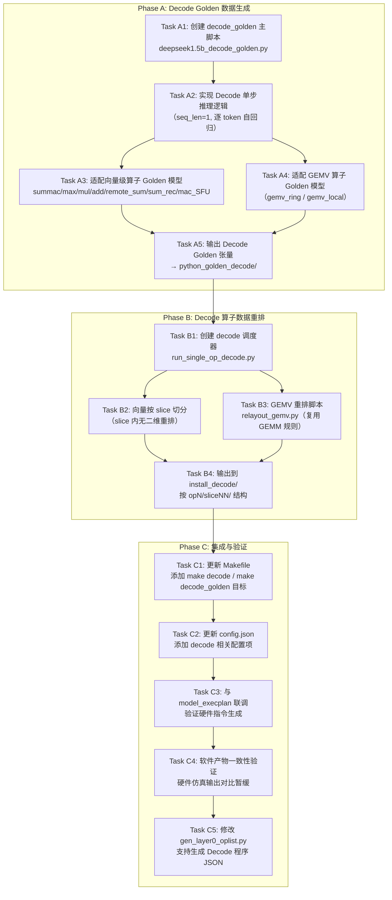

# Generate Python Golden — DeepSeek-1.5B Prefill / Decode 黄金数据生成与硬件适配工具

## 目录

- [Generate Python Golden — DeepSeek-1.5B Prefill / Decode 黄金数据生成与硬件适配工具](#generate-python-golden--deepseek-15b-prefill--decode-黄金数据生成与硬件适配工具)
  - [目录](#目录)
  - [概述](#概述)
  - [项目结构](#项目结构)
  - [整体流水线](#整体流水线)
  - [配置文件：`config.json`](#配置文件configjson)
  - [第一阶段：Python Golden 数据生成](#第一阶段python-golden-数据生成)
    - [`generate_seq_input.py`](#generate_seq_inputpy)
    - [`create_dummy_inputs.py`](#create_dummy_inputspy)
    - [`weight_gen.py`](#weight_genpy)
    - [`create_summac_data.py`](#create_summac_datapy)
    - [`deepseek1.5b_3_time_golden_smallsize.py`（主脚本）](#deepseek15b_3_time_golden_smallsizepy主脚本)
  - [第二阶段：单算子数据切片与重排](#第二阶段单算子数据切片与重排)
    - [`run_single_op.py`（调度器）](#run_single_oppy调度器)
    - [`single_op_data/` — 算子重排脚本详解](#single_op_data--算子重排脚本详解)
      - [`relayout_gemm.py` — GEMM 矩阵乘法重排](#relayout_gemmpy--gemm-矩阵乘法重排)
      - [`relayout_rmsnorm.py` — RMS Norm 重排](#relayout_rmsnormpy--rms-norm-重排)
      - [`relayout_softmax.py` — Softmax 重排](#relayout_softmaxpy--softmax-重排)
      - [`relayout_rope.py` — RoPE 重排](#relayout_ropepy--rope-重排)
      - [`relayout_layer0.py` — Layer0 批量调度](#relayout_layer0py--layer0-批量调度)
      - [`relayout_mul_MN_N_kv.py` — KV 投影专用 Mul 重排](#relayout_mul_mn_n_kvpy--kv-投影专用-mul-重排)
      - [`relayout_regular.py` — 通用逐元素算子重排](#relayout_regularpy--通用逐元素算子重排)
      - [`relayout_remote_sum.py` — 跨片归约重排](#relayout_remote_sumpy--跨片归约重排)
      - [`backup/` — 历史备份](#backup--历史备份)
  - [辅助文件说明](#辅助文件说明)
  - [使用方法](#使用方法)
    - [环境准备](#环境准备)
    - [一键执行完整流程（推荐）](#一键执行完整流程推荐)
    - [分步执行](#分步执行)
      - [Decode 阶段命令](#decode-阶段命令)
    - [自定义配置](#自定义配置)
  - [输出目录结构](#输出目录结构)
    - [文件命名规范](#文件命名规范)
  - [第三阶段：Decode 阶段 Golden 数据生成与重排（已完成）](#第三阶段decode-阶段-golden-数据生成与重排已完成)
    - [背景：Prefill vs Decode 的计算特征差异](#背景prefill-vs-decode-的计算特征差异)
    - [关键设计原则](#关键设计原则)
    - [已有 Decode 算子 JSON 清单](#已有-decode-算子-json-清单)
    - [Decode 阶段任务清单](#decode-阶段任务清单)
      - [详细任务分解](#详细任务分解)
        - [Phase A: Decode Golden 数据生成](#phase-a-decode-golden-数据生成)
        - [Phase B: Decode 算子数据重排](#phase-b-decode-算子数据重排)
        - [Phase C: 集成与验证](#phase-c-集成与验证)
    - [Decode 阶段实际新增/修改文件](#decode-阶段实际新增修改文件)
    - [Decode 算子命名对照表](#decode-算子命名对照表)

---

## 概述

本工具集用于 **DeepSeek-R1-Distill-Qwen-1.5B** 大语言模型 **Prefill 阶段**和 **Decode 阶段**的黄金数据（Golden Data）生成，并支持按硬件内存布局对数据进行**切片（Slice）与重排（Relayout）**，以适配 NDP（Near-Data Processing）硬件仿真器的加载格式。

整个流水线分为三大阶段：

| 阶段 | 目标 | 核心产出 |
|------|------|----------|
| **第一阶段：Prefill Golden 生成** | 模拟单层 Transformer 的完整推理计算（多 token 并行），保存所有算子的输入/输出张量 | `python_golden/` 下的 `.bin` 张量文件 |
| **第二阶段：Prefill 切片重排** | 将 Prefill Golden 数据按硬件 slice 拓扑进行分片、维度置换、格式转换 | `single_op_data/install/` 下的分片 `.bin` 及 `128-bit .txt` |
| **第三阶段：Decode Golden 生成与重排（已完成）** | 生成一个 Decode step 的 10 个算子 Golden，按 28 个 slice 切分/重排并生成 execution plan | `python_golden_decode/`、`single_op_data/install_decode/`、`model_execplan/output/layer0_decode/` |

---

## 项目结构

```
generate_python_golden/
├── config.json                              # 核心配置文件（模型维度、序列长度、目标算子等）
├── Makefile                                 # Prefill/Decode 自动化入口
├── README.md                                # 本文件
├── tensor_io.py                             # Golden/install 文件命名、读写及 128-bit 文本转换
├── decode_ops.py                            # 19 个 Decode 算子注册表 + 43-op 全层 Golden 模型
├── decode_data_loader.py                    # 从 model_weights_32 加载真实权重 + KV cache 生成/加载
├── generate_decode_execplan_inputs.py       # 生成 Decode 单算子 execution-plan 图
├── generate_decode_program_json.py          # 从 manifest 生成 prefill 兼容的 layer0_decode.json（43-op）
├── assemble_decode_package.py               # 按 sca_cfg 汇集自包含 Decode 加载包并记录哈希
├── validate_decode_outputs.py               # 软件产物只读验收（不依赖硬件仿真器）
│
├── generate_seq_input.py                    # [辅助] 根据已有输入按指定 seq_len 复制/tiling 生成新输入
├── create_dummy_inputs.py                   # [阶段1-步骤1] 生成虚拟输入张量（随机数）
├── weight_gen.py                            # [阶段1-步骤2] 从原始权重裁剪/提取小尺寸权重
├── create_summac_data.py                    # [阶段1-辅助] 单独生成 sum_mac 算子数据并做 slice 验证
│
├── deepseek1.5b_3_time_golden_smallsize.py  # [阶段1-步骤3] ★ Prefill 主脚本：模拟单层 Transformer 并保存所有张量
├── deepseek1.5b_decode_golden.py            # [阶段3-步骤1] ★ 生成一个确定性 Decode step
├── deepseek1.5b_3_time_golden.py            # 旧版（全尺寸）主脚本
├── deepseek1.5b_3_time_golden_smallsize_0527.py  # 旧版归档
├── deepseek1.5b_3_time_golden_smallsize copy.py  # 旧版备份
│
├── run_single_op.py                         # [阶段2-调度器] 按 target_op 触发对应重排脚本并级联 execplan
├── run_single_op_decode.py                  # [阶段3-调度器] Decode 分 slice + GEMV 重排
├── gen_layer0_oplist.py                     # [阶段3-集成] --decode 生成 layer0_decode.json
│
├── rope_fp32/                               # RoPE 算子的预计算 cos/sin 查找表
│   ├── rope_neox_cos_float32_ne2_512.bin
│   └── rope_neox_sin_float32_ne2_512.bin
│
├── single_op_data/                          # [阶段2-核心] 各算子的重排（Relayout）脚本
│   ├── relayout_gemm.py                     #   GEMM (Ring All-Reduce) 矩阵乘法的切片重排
│   ├── relayout_gemm_local.py               #   GEMM (Local) 局部矩阵乘法重排
│   ├── relayout_gemm_old.py                 #   GEMM 旧版重排逻辑
│   ├── relayout_rmsnorm.py                  #   RMS Norm 归一化算子重排
│   ├── relayout_rope.py                     #   RoPE 旋转位置编码重排
│   ├── relayout_softmax.py                  #   Softmax 注意力权重归一化重排
│   ├── relayout_layer0.py                   #   Layer0 整层全算子批量重排调度
│   ├── relayout_mul_MN_N_kv.py              #   Mul (KV 投影专用) 元素乘法的重排
│   ├── relayout_regular.py                  #   Regular 通用逐元素算子 (Add/Mul/SiLU) 重排
│   ├── relayout_remote_sum.py               #   Remote Sum 跨片归约求和重排
│   ├── decode_passthrough.py                #   向量按 slice 连续切分，不改变 slice 内顺序
│   ├── relayout_gemv.py                     #   GEMV 权重矩阵重排（复用 GEMM 逻辑）
│   └── backup/                              #   上述部分脚本的历史备份
│
├── model_execplan/                          # 上游 execution-plan 生成器及 Decode 图/产物
├── jsons/                                   # 上游 10 个 Decode 硬件配置 JSON
├── bitstream/                               # 上游 bitstream 生成器（可视化依赖已改为可选）
└── DeepSeek-R1-Distill-Qwen-1.5B-f16/       # Prefill 可用；本阶段 Decode 暂不读取真实权重
```

---

## 整体流水线

```mermaid
flowchart TD
    subgraph Prefill["Prefill 阶段"]
        A[config.json] --> B[create_dummy_inputs.py]
        A --> C[weight_gen.py]
        B --> D["inputs/ (虚拟输入 .bin)"]
        C --> E["model_weights_small/ (裁剪权重 .bin)"]
        D --> F[deepseek1.5b_3_time_golden_smallsize.py]
        E --> F
        F --> G["python_golden/ (所有算子 IO 张量)"]
        G --> H[run_single_op.py]
        H --> I["single_op_data/relayout_*.py"]
        I --> J["single_op_data/install/ (分片 .bin + 128-bit .txt)"]
        J --> K["model_execplan/main.py (指令生成)"]
    end

    subgraph Decode["Decode 阶段"]
        L[config.json] --> M[deepseek1.5b_decode_golden.py]
        M --> N["python_golden_decode/ (向量级 Golden 数据)"]
        N --> O[run_single_op_decode.py]
        O --> P["relayout_gemv.py (复用 GEMM 规则)"]
        O --> Q["向量按 slice 连续切分"]
        P --> R["single_op_data/install_decode/"]
        Q --> R
        L --> T[generate_decode_execplan_inputs.py]
        T --> U["gen_layer0_oplist.py --decode"]
        U --> S["model_execplan/main.py"]
        R --> W[assemble_decode_package.py]
        S --> W
        W --> X["model_execplan/output/layer0_decode/ 自包含加载包"]
        X --> V[validate_decode_outputs.py]
    end
```



---

## 配置文件：`config.json`

```json
{
    "hidden_size": 896,
    "intermediate_size": 1792,
    "num_attention_heads": 7,
    "num_key_value_heads": 1,
    "head_dim": 128,
    "num_hidden_layers": 1,
    "sequence_length": 32,
    "slice_per_head": 4,
    "used_slices": 28,
    "kv_padding": 256,
    "target_op": "all",
    "target_op_decode": "all",
    "kv_cache_initial_length": 32,
    "decode_steps": 1,
    "decode_attention_length": 32,
    "random_seed": 0
}
```

| 参数 | 含义 |
|------|------|
| `hidden_size` | 隐藏层维度（$d_{model}$） |
| `intermediate_size` | FFN 中间层维度 |
| `num_attention_heads` | 查询头数（Q heads） |
| `num_key_value_heads` | 键值头数（KV heads，GQA） |
| `head_dim` | 每个注意力头的维度 |
| `num_hidden_layers` | 模型总层数 |
| `sequence_length` | 当前测试的初始序列/KV cache 长度（32） |
| `slice_per_head` | 每个 head 分配的 slice 数 |
| `used_slices` | 实际使用的硬件 slice 总数（28） |
| `kv_padding` | KV cache 的 padding 对齐值 |
| `target_op` | 第二阶段目标算子：`"all"` / `"gemm"` / `"rmsnorm"` / `"rope"` / `"softmax"` |
| `target_op_decode` | Decode 目标算子全名或 `"all"` |
| `kv_cache_initial_length` | Decode 开始前的 KV cache 长度，本阶段为 32 |
| `decode_steps` | 生成的 Decode step 数；当前实现固定支持 1 |
| `decode_attention_length` | 当前 step 使用的注意力向量长度，本阶段为 32，不追加到 33 |
| `random_seed` | 合成输入及临时 GEMV 权重的随机种子，保证可复现 |

本阶段固定使用 `hidden_size=896`，不做 hidden padding。真实模型权重由 `model_weights_32/` 提供（已裁切到 896×1792 维度）。KV cache 通过 mini-prefill 预生成并缓存复用。

---

## 第一阶段：Python Golden 数据生成

本阶段目标：**模拟一个 Transformer 层的完整计算图，将每个算子的输入和输出张量以 `.bin` 保存**。

### `generate_seq_input.py`

**功能**：根据已有的 base 输入（如 `inputs_good/` 下 `seq_len=8` 的 `.bin`），通过 `np.repeat` 沿序列维度复制/tiling，生成指定 `sequence_length`（由 `config.json` 读取）的新输入文件。

- 输入：`inputs_good/` 中的 base `.bin` 文件
- 输出：`python_golden_custom_seq/` 下对应新 `seq_len` 的 `.bin`
- 使用场景：当需要快速切换序列长度而无需重新生成随机输入时

### `create_dummy_inputs.py`

**功能**：根据 `config.json` 中的维度参数，创建三个虚拟输入张量：

| 输入名 | 形状 | 数据类型 | 含义 |
|--------|------|----------|------|
| `inp_embd` | `(hidden_size, seq_len, 1, 1)` | float32 | Token 嵌入向量 |
| `leaf_12` | `(mask_dim, seq_len, 1, 1)` | float32 | Attention mask |
| `leaf_395` | `(1, 1, 1, 1)` | int32 | 位置偏移量（通常为 0） |

- 浮点数使用 `np.random.rand` 生成 $[-1, 1)$ 范围的随机值（固定 seed=0 保证可复现）
- 输出目录：`inputs/`
- 所有张量以 Fortran 列优先（`order='F'`）写入 `.bin`

### `weight_gen.py`

**功能**：从原始全尺寸权重文件 `DeepSeek-R1-Distill-Qwen-1.5B-f16/` 中提取并裁剪出适配当前 `config.json` 配置的小尺寸权重。

- 原始权重的文件命名格式：`<name>__dtype=<f16|f32>__shape=<HxW>.bin`
- 根据 `hidden_size`、`intermediate_size`、`head_dim` 等参数对权重矩阵做切片裁剪
- 输出目录：`model_weights_small/`
- 同时生成完整的 `model_weights_full/` 副本

> ⚠️ **重要**：`DeepSeek-R1-Distill-Qwen-1.5B-f16/` 原始权重文件夹需**手动下载**并放置于此目录下，它不在版本控制中。

### `create_summac_data.py`

**功能**：独立生成 `sum_mac`（平方和累加）算子的测试数据，是 RMS Norm 的第一个子步骤（`op0`）。

- 生成随机输入矩阵，用硬件对齐的 `fma(a, b, acc)` 计算每列的平方和
- 按 28 个 slice 进行分片输出
- 输出目录：`summac_data/install/op0/`
- 输出格式：`.bin` 张量 + `128-bit .txt`（每行 4 个 float32 的二进制拼接）+ 十进制可读 `.txt`

### `deepseek1.5b_3_time_golden_smallsize.py`（主脚本）

这是整个流水线的**核心脚本**，模拟一个完整 Transformer 层的推理计算。

**模型架构覆盖**：

```
输入嵌入
  ├── RMS Norm (Attn)          → rms_norm()
  ├── Q/K/V 投影 (GEMM Ring)   → gemv_ring()  # All-Reduce 矩阵乘法
  ├── RoPE 位置编码            → rope()
  ├── Attention Score 计算     → gemv_local()  # Q·K^T
  ├── Softmax                  → softmax()
  ├── Attention Output (SV)    → gemv_local()  # Softmax·V
  ├── Residual Add             → add()
  ├── RMS Norm (FFN)           → rms_norm()
  ├── FFN Gate/Up 投影         → gemv_ring()
  ├── SiLU 激活                → silu()
  ├── Element-wise Mul         → mul()
  ├── FFN Output 投影          → gemv_ring()
  └── Residual Add             → add()
```

**关键设计**：

- **`save_io_tensor(name, tensor, is_sub_op)`**：统一的张量保存函数，按 `(shape, dtype)` 生成规范化文件名并写入 `python_golden/` 或 `python_golden/sub_ops/`
- **`fp32_fma_accumulate(acc, a, b)`**：硬件对齐的 FMA（Fused Multiply-Add），优先使用 `math.fma`，确保与硬件仿真结果 bit-exact 一致
- **子算子追踪**：对于 RMS Norm、Softmax 等复杂算子，内部的中间步骤（如 `sum_mac`、`mac_rec_sqrt`、`max`、`mac_sum`、`remote_sum` 等）会单独存入 `python_golden/sub_ops/`，便于硬件分步验证

**输入依赖**：
- `inputs/` 中的虚拟输入（由 `create_dummy_inputs.py` 生成）
- `model_weights_small/` 中的裁剪权重（由 `weight_gen.py` 生成）
- `rope_fp32/` 中的 RoPE cos/sin 查找表

---

## 第二阶段：单算子数据切片与重排

本阶段目标：**读取第一阶段生成的 Golden 数据，按照硬件 NDP 架构的 slice 拓扑进行数据分片、维度置换（Relayout）和格式转换**。

### `run_single_op.py`（调度器）

**功能**：读取 `config.json` 中的 `target_op` 字段，依次调度对应的重排脚本，并在重排完成后级联执行 `model_execplan/main.py` 生成硬件指令。

**调度逻辑**：

```
target_op = "all"
  ├── relayout_gemm.py
  ├── relayout_rmsnorm.py
  ├── relayout_rope.py
  └── relayout_softmax.py

target_op = "gemm" / "rmsnorm" / "rope" / "softmax"
  └── relayout_<op>.py
```

**级联流程**：
1. 运行 `relayout_<op>.py` → 生成 `single_op_data/install/` 下的分片数据
2. 对 `rmsnorm` / `softmax` 等支持地址重映射的算子，调用 `address_remapping` 模块处理
3. 调用 `model_execplan/main.py <op>.json` 生成硬件执行计划

### `single_op_data/` — 算子重排脚本详解

所有重排脚本共享一套通用工具函数：

| 工具函数 | 功能 |
|----------|------|
| `float_to_bin(f)` | float32 → 32-bit 二进制字符串 |
| `float16_to_bin(f)` | float16 → 16-bit 二进制字符串 |
| `int32_to_bin(i)` | int32 → 32-bit 二进制字符串 |
| `convert_to_decimal_txt()` | `.bin` → 十进制可读 `.txt`（重排后输出 `_decimal_1d.txt`，重排前输出 `_decimal.txt` 矩阵形式） |
| `convert_to_128bit_txt()` | `.bin` → 每行 128-bit（4×float32）二进制 `.txt` |
| `dtype_from_filename()` | 从文件名 `_dtype_xxx` 解析 numpy dtype |
| `load_model_params()` | 从 `config.json` 加载模型参数 |

#### `relayout_gemm.py` — GEMM 矩阵乘法重排

处理 **Ring All-Reduce** 拓扑下的 GEMM 算子。核心逻辑：

- 解析文件名的正则：`blk.<layer>_<op_name>_op-mul_mat_<in0|in1|out>_shape<...>_dtype_<...>.bin`
- 支持的 GEMM 类型：`ffn_gate`、`ffn_up`、`ffn_out`、`q_gen`、`k_gen`、`v_gen`、`atten_final`
- 输出按 `op<N>/slice<NN>/` 目录结构组织，每个 slice 包含该分片的完整张量

#### `relayout_rmsnorm.py` — RMS Norm 重排

处理 RMS Normalization 算子及其子算子：
- 主算子：`rms_norm`（输入归一化）
- 子算子：`sum_mac`（平方和累加）、`mac_rec_sqrt`（倒数平方根）、`mul`（逐元素缩放）
- 重排逻辑：按 `(M=32, N=28)` 的 slice 维度进行数据切分和重排

#### `relayout_softmax.py` — Softmax 重排

处理 Self-Attention 中的 Softmax 归一化及其子步骤：
- 子算子：`max`（行最大值）、`mac_sum`（指数和）、`remote_sum`（跨片归约）
- 重排时考虑 mask 维度的对齐（`(seq_len+31)//32*32`）

#### `relayout_rope.py` — RoPE 重排

处理 Rotary Position Embedding 算子：
- 输入为 Q/K 的 `(head_dim, num_heads, seq_len)` 张量
- 结合 `rope_fp32/` 中的预计算 cos/sin 表进行旋转
- 按 slice 拓扑进行分片输出

#### `relayout_layer0.py` — Layer0 批量调度

特殊的全层调度脚本，它不直接做重排，而是**遍历 Layer0 中所有算子类型，分别调用对应的 `relayout_*.py` 逻辑**，实现一键重排整个第一层。

- 使用 `get_category_and_prefix()` 函数将算子模板名映射到 `(category, prefix)` 元组
- category 决定调用哪类重排逻辑：`gemm_ring`、`gemm_local`、`rmsnorm`、`rope`、`regular`、`mul_MN_N_kv`、`softmax`

#### `relayout_mul_MN_N_kv.py` — KV 投影专用 Mul 重排

处理 Attention 中 Q/K/V 投影时的逐元素乘法（`hidden_states * weight_scale`），针对 KV 的特定维度排列做适配。

#### `relayout_regular.py` — 通用逐元素算子重排

处理常规的逐元素操作：**Add**（残差连接）、**Mul**（门控乘法）、**SiLU**（激活函数）等。

#### `relayout_remote_sum.py` — 跨片归约重排

处理 Attention 中需要跨 slice 通信的 `remote_sum` 归约操作，涉及 Ring 拓扑下的数据聚合。

#### `backup/` — 历史备份

存放上述脚本的早期版本，用于版本回溯和对比参考。

---

## 辅助文件说明

| 文件 | 说明 |
|------|------|
| `deepseek1.5b_3_time_golden.py` | 旧版全尺寸模型 Golden 生成脚本 |
| `deepseek1.5b_3_time_golden_smallsize_0527.py` | `smallsize` 版本的 5月27日归档 |
| `deepseek1.5b_3_time_golden_smallsize copy.py` | `smallsize` 版本的临时备份 |
| `rope_fp32/rope_neox_cos_float32_ne2_512.bin` | NeoX-style RoPE 的 cos 预计算表 `(2, 512)` |
| `rope_fp32/rope_neox_sin_float32_ne2_512.bin` | NeoX-style RoPE 的 sin 预计算表 `(2, 512)` |

---

## 使用方法

### 环境准备

```bash
pip install numpy tqdm
```

`matplotlib` 仅在显式请求 bitstream placement 可视化时需要，正常 Decode bitstream/execplan 生成不再强制依赖它。

### 一键执行完整流程（推荐）

```bash
make
```

该命令等价于：`make golden` → `make single_op`

### 分步执行

| 命令 | 功能 |
|------|------|
| `make inputs` | 仅生成虚拟输入 (`inputs/`) |
| `make weights` | 仅裁剪权重 (`model_weights_small/`) |
| `make golden` | 执行第一阶段：生成 Golden 数据 (`python_golden/`) |
| `make single_op` | 执行第二阶段：算子切片重排 (`single_op_data/install/`) |
| `make clean` | 清理所有生成目录 |

#### Decode 阶段命令

| 命令 | 功能 |
|------|------|
| `make decode_golden` | 仅生成 Decode Golden 数据 (`python_golden_decode/`) |
| `make decode_single_op` | 仅执行 Decode 算子重排 (`single_op_data/install_decode/`) |
| `make decode_graphs` | 生成 10 个 Decode execution-plan 单算子图 |
| `make decode_layer0` | 生成 `model_execplan/examples/layer0_decode.json` 及 op 映射 |
| `make decode_execplan` | 重生成 10 个 bitstream 并生成 Decode 指令 |
| `make decode_package` | 按 `sca_cfg.json` 汇集全部指令、配置和输入张量，生成自包含加载包及 SHA-256 manifest |
| `make decode_validate` | 校验 Golden、28-slice install 数据、bitstream、指令及加载包路径/哈希 |
| `make decode` | 一键执行 Decode 完整软件流程（Golden → slice/relayout → execplan → package → validate） |
| `make all` | 执行 Prefill + Decode 全部流程 |

裸 `make`/`make prefill` 仍保持原行为，只执行 Prefill。Windows 环境若没有 GNU Make，可依次直接运行：

```bash
python deepseek1.5b_decode_golden.py
python run_single_op_decode.py
python generate_decode_execplan_inputs.py
python gen_layer0_oplist.py --decode
python model_execplan/main.py model_execplan/examples/layer0_decode.json
python assemble_decode_package.py
python validate_decode_outputs.py
```

### 自定义配置

1. 修改 `config.json` 中的参数（如 `sequence_length`、`target_op`、`target_op_decode`）
2. Decode 可将 `target_op_decode` 设为下文 10 个算子之一或 `"all"`
3. 运行 `make` 或对应的分步命令

---

## 输出目录结构

执行完整流程后，生成的关键目录结构如下：

```
generate_python_golden/
├── inputs/                           # 虚拟输入张量
│   ├── inp_embd_shape896x32x1x1_dtype_f32.bin
│   ├── leaf_12_shape32x32x1x1_dtype_f32.bin
│   └── leaf_395_shape1x1x1x1_dtype_i32.bin
│
├── model_weights_small/              # 裁剪后的小尺寸权重
│   └── *.bin
│
├── python_golden/                    # ★ 第一阶段产出：所有算子的 IO 张量
│   ├── blk.0_attn_norm-0_op-rms_norm_in0_shape*.bin
│   ├── blk.0_attn_norm-0_op-rms_norm_out_shape*.bin
│   ├── ... (大量 .bin 文件)
│   └── sub_ops/                      # 复杂算子的中间步骤张量
│       ├── blk.0_attn_norm-0_op-rms_norm_sum_mac_out_shape*.bin
│       ├── blk.0_attn_norm-0_op-rms_norm_mac_rec_sqrt_out_shape*.bin
│       └── ...
├── python_golden_decode/             # ★ 第三阶段 Golden：10 个算子 IO + manifest.json
│   ├── decode_*_shape*_dtype_*.bin
│   ├── manifest.json
│   └── sub_ops/
│
├── single_op_data/
│   ├── install/                      # ★ 第二阶段 Prefill 数据
│   │   ├── op0/                      # sum_mac (RMS Norm 的子步骤)
│   │   │   ├── slice00/
│   │   │   ├── ...
│   │   │   └── slice27/
│   │   ├── op1/                      # mac_rec_sqrt
│   │   ├── op2/                      # mul (RMS Norm 输出缩放)
│   │   ├── op3/                      # max (Softmax 子步骤)
│   │   ├── ...
│   │   └── opN/
│           ├── slice00/
│           │   ├── *.bin             # 分片张量（二进制）
│           │   ├── *.txt             # 128-bit 二进制文本（硬件加载格式）
│           │   └── *_decimal*.txt    # 十进制可读文本（调试用）
│           └── ...
│   └── install_decode/               # ★ 第三阶段 10 × 28 slice 数据
│       ├── manifest.json
│       ├── op0/slice00/...slice27/
│       ├── ...
│       └── op9/slice00/...slice27/
│
└── model_execplan/
    ├── examples/layer0_decode.json
    └── output/layer0_decode/
        ├── config/op0/...op9/         # 各算子 64/128-bit bitstream
        ├── install/
        │   ├── cfg_pkg/               # execution-plan 引用的硬件配置文件
        │   ├── execplan.txt           # 128-bit 指令文本
        │   └── op0/...op9/slice*/     # 汇集后的 matrix 输入文本
        ├── sca_cfg.json               # 加载路径清单
        └── decode_package_manifest.json  # 461 个路径的大小与 SHA-256
```

### 文件命名规范

Golden 数据和重排文件的命名遵循统一规范：

- **Golden 张量**：`<算子名>_shape<WxHxCxN>_dtype_<f32|f16|i32>.bin`
  - 例：`decode_mul_fp32N_fp32N_fp16N_in0_shape896x1x1x1_dtype_f32.bin`
- **Decode install `.bin`**：`matrix_<A|B|Bp|D>_linearized_128bit.bin`，按 `op<N>/slice<NN>/` 存放
- **128-bit `.txt`**：与 `.bin` 同名；fp32/i32 每行 4 lane，fp16 每行 8 lane，不足补 0；与原脚本一致按 lane 逆序拼接
- **十进制 `.txt`**：Decode 统一为 `*_decimal_1d.txt`，每行一个数，供人工调试

---

## 第三阶段：Decode 阶段 Golden 数据生成与重排（已完成）

本阶段已基于 `uSFrances/ndp-sim` 的 `5791ba349cd5bf9b2c90af0afcba3fab39f94e4c` 基线完成。当前交付范围和已确认约束如下：

- `hidden_size=896`，不做 hidden padding；28 个 slice，每个 hidden slice 恰好 32 个元素。
- KV cache 初始长度、`sequence_length` 和当前注意力长度均为 32；只生成 step 0，一个 Decode step。
- **43-op 完整解码层**，严格镜像 Prefill `layer0_0610_remapped.json` 的算子拓扑（19 种算子类型）。
- 程序 JSON（`layer0_decode.json`）使用 prefill 兼容的 3D 形状约定 `[1, 1, N]`、正确的分支/汇合 source 引用、`fp16` 显式 dtype（fp32 隐式）。
- **RoPE 无需跨 slice 数据交换**：通过重排 sin table（`[+sin,-sin]` → `[-sin,+sin]`）和半区交换 op8/op18 的激活输入，op9/op19 可直接做逐元素 ADD 得到正确 RoPE 结果。`rope_slice_xor2` 类型标记已移除。
- 程序 JSON 中 op22/op29 的 K/V cache 来自 `ext`（外部存储），而非 op19/op21（仅当前 token）。
- Attention 链（op22~op28）shape 为 decode 向量语义（`[1, 1, attention_length]`），非 prefill 矩阵语义。
- mul_cast（RMS Norm scale）使用 `hidden_size` 维随机权重向量，非标量 1.0。
- 端口顺序与 prefill 一致：add_residual 的 A=外部残差/B=数据路径；mul_cast 的 A=scale/B=data。
- GEMV 权重复用 GEMM 的 Ring/Local relayout 规则（`N8K2N4K` / `N8M2N4`），B/B' 对半拆分。
- install 数据按 `op0`~`op42` 编号命名文件夹（通过 manifest 中的 `layer_idx` 字段）。
- 真实权重由 `decode_data_loader.py` 从 `model_weights_32/` 加载，KV cache 首次运行自动生成并缓存到 `kv_cache/`。`build_decode_golden_cases(config, weights=..., kv_cache=...)` 传 `None` 可回退随机合成。

### 背景：Prefill vs Decode 的计算特征差异

在大语言模型推理中，**Prefill** 和 **Decode** 是两个截然不同的阶段：

| 特征 | Prefill 阶段 | Decode 阶段 |
|------|-------------|-------------|
| **输入形式** | 多 token 序列 $(\text{seq\_len} > 1)$ | 单 token $(\text{seq\_len} = 1)$ |
| **数据形状** | **Tensor**（多维）：如 `(hidden_size, seq_len)` | **Vector**（一维）：如 `(hidden_size,)` |
| **核心算子** | GEMM（矩阵乘）、RMS Norm（张量归一化）、Softmax（矩阵归一化） | GEMV（矩阵-向量乘）、逐元素向量操作 |
| **算子命名** | `prefill_<op>_fp32MN_fp32MN` | `decode_<op>_fp32N_fp32N` |
| **重排需求** | 所有 Tensor 算子需 2D 分片重排 | 向量只按 slice 连续切分；GEMV 权重复用 GEMM 规则 |

### 关键设计原则

1. **向量按 slice 切分但不做二维重排**：hidden 向量按 28 份连续切分（每份 32 元素）；注意力向量先按 head，再按每 head 的 4 个 slice 切分。slice 内元素顺序不变；长度为 1 的标量按需复制到所有 slice。

2. **程序 JSON 严格镜像 Prefill**：43-op 解码层使用 prefill 兼容的 3D 形状约定（如 `[1, 1, "hidden_size//used_slices"]`）、正确的分支/汇合 source 引用、`fp16` 显式 dtype（fp32 隐式）。

3. **RoPE 通过 table 重排消除跨 slice 路由**：sin table 重排为 `[-sin, +sin]`（前后半区交换），op8/op18 的激活输入做半区交换，op9/op19 直接逐元素 ADD 即得正确 RoPE。不再需要 `rope_slice_xor2` 类型标记。

4. **GQA 支持（num_kv_heads=1）**：K/V 分支输出维度 `kv_dim=128`（仅 1 个 KV head），使用独立 RoPE table（128 维）。K/V GEMV ring 使用 `KV_HW_PARAMS`（4 slices），K/V passthrough 自动检测并降为 4 slices。K/V cache 形状 `(128, 32, 1)`，通过 `np.tile` 广播到 7 个 Q head。

5. **真实权重加载**：`decode_data_loader.py` 从 `model_weights_32/` 加载已裁切权重，`build_decode_golden_cases(config, weights=..., kv_cache=...)` 可选传参，传 `None` 回退随机生成。

6. **KV cache 预生成**：运行一次 mini-prefill（真实权重 + K/V 投影 + RoPE），生成 `kv_cache/layer0_kv_cache.npz`，后续 decode 直接加载复用，确保测试数据与实际 pipeline 一致。

7. **GEMV 复用 GEMM 重排规则**：Ring 权重按 N 轴切片 → ring reorder → `N8K2N4K` relayout → B/B' 对半拆分。Local 权重按 K 轴切片 → `N8M2N4` relayout → B/B' 对半拆分。

4. **mul_cast 使用真实 scale 向量**：RMS Norm 的 scale 步骤使用 `hidden_size` 维随机权重向量（范围 0.5~1.5），非标量 1.0。

5. **端口顺序与 prefill 一致**：add_residual（op6/16/21）的 A=外部残差、B=数据路径；mul_cast（op4/14/36）的 A=scale 权重、B=归一化数据。

6. **install 目录按 op 编号命名**：通过 manifest 中的 `layer_idx`（0~42）生成 `op0`~`op42` 文件夹。

### 已有 Decode 算子 JSON 清单

以下 19 种 Decode 算子类型已注册（`decode_ops.py` 中 `SUPPORTED_DECODE_OPERATORS`），
完整 43-op 解码层严格镜像 Prefill `layer0_0610_remapped.json` 的拓扑结构：

| 算子类型 | 用途 | 层中出现次数 |
|----------|------|-------------|
| `decode_summac_fp32N_fp32N` | 平方和累加（RMS Norm 步骤1） | 3 次 (Attn/KV/FFN) |
| `decode_remote_sum_fp32N_fp32N` | 跨片归约（RMS Norm/QKT 步骤2） | 4 次 |
| `decode_mac_SFU_fp32N_fp32N` | 倒数平方根（RMS Norm 步骤3） | 3 次 |
| `decode_mul_fp32N_fp32_fp32N` | 向量×标量（RMS Norm scale 施加） | 3 次 |
| `decode_mul_fp32N_fp32N_fp16N` | 向量×向量 → fp16（RMS Norm cast） | 3 次 |
| `decode_gemv_ring` | Ring All-Reduce 矩阵-向量乘 | 7 次 (Q/K/V/Out/Gate/Up/FFN-Out) |
| `decode_add_fp16N_fp32N_fp32N` | fp16 + fp32 残差加（Q/K 残差） | 2 次 |
| `decode_mul_fp32N_fp32N_fp32N` | 向量×向量（RoPE cos/sin） | 4 次 (Q cos/sin, K cos/sin) |
| `decode_add_fp32N_fp32N_fp16N` | RoPE 合并 add → fp16 | 2 次 (Q/K merge) |
| `decode_max_fp32N_fp32N` | 每 head 局部最大值（Softmax 步骤1） | 1 次 |
| `decode_sub_SFU_fp32N_fp32_fp32N` | 向量−标量（scores − max） | 1 次 |
| `decode_sum_rec_fp32N_fp32N` | 求和倒数（Softmax 步骤2） | 1 次 |
| `decode_mul_fp32N_fp32_fp16N` | 向量×标量 → fp16（Softmax 输出） | 1 次 |
| `decode_gemv_local` | 局部矩阵-向量乘（QK^T / SV） | 2 次 |
| `decode_add_fp32N_fp16N_fp32N` | fp32 + fp16 残差加（Out/FFN 残差） | 2 次 |
| `decode_silu_fp16N_fp32N` | SiLU 激活 | 1 次 |
| `decode_mul_fp32N_fp16N_fp16N` | silu(gate) × up（SwiGLU） | 1 次 |
| `decode_add_fp16N_fp32N_fp16N` | fp16 + fp32 → fp16（V 残差） | 1 次 |
| `decode_add_fp32N_fp32N_fp32N` | fp32 + fp32（attention mask add） | 1 次 |

### Decode 阶段任务清单

以下是第三阶段的实现链路；除按要求暂不执行的硬件输出对比外，其余任务均已落地并通过软件验证：



#### 详细任务分解

##### Phase A: Decode Golden 数据生成

| 任务编号 | 任务名称 | 实现结果 | 状态 |
|----------|----------|------|-----------|
| **A1** | Decode 主脚本 | 新增 `deepseek1.5b_decode_golden.py`，支持 config/target/output CLI 与 manifest | ✅ 完成 |
| **A2** | 单步推理 | 固定 KV=32、step=0，只生成一个 Decode step，不扩为 33 | ✅ 完成 |
| **A3** | 向量算子 Golden | 在 `decode_ops.py` 实现 fp32 FMA、局部 max/sum-rec、remote sum、REC_SQRT、mul/add | ✅ 完成 |
| **A4** | GEMV Golden | 实现 Ring 完整输出和 Local 四个 K-slice partial 输出，使用确定性合成 fp16 权重 | ✅ 完成 |
| **A5** | Golden 输出 | 生成 43 个 layer instance（19 种算子类型）的 shape/dtype 命名 `.bin` 与 `manifest.json` | ✅ 完成 |

当前 43 个对象对应完整解码层的 43 个算子实例；`sub_ops/` 作为后续组合算子的中间结果目录保留。

##### Phase B: Decode 算子数据重排

| 任务编号 | 任务名称 | 实现结果 | 状态 |
|----------|----------|------|-----------|
| **B1** | Decode 调度器 | `run_single_op_decode.py` 读取注册表/manifest，支持 `target_op_decode` 和单算子选择 | ✅ 完成 |
| **B2** | 向量分 slice | `decode_passthrough.py` 连续切分 vector/head vector，并生成三种格式；标量按需复制 | ✅ 完成 |
| **B3** | GEMV relayout | `relayout_gemv.py` 复用 Ring/Local GEMM relayout，独立输出 B 与 B' | ✅ 完成 |
| **B4** | install 输出 | `op0` 至 `op9` 均生成 `slice00` 至 `slice27` 与 install manifest | ✅ 完成 |

##### Phase C: 集成与验证

| 任务编号 | 任务名称 | 实现结果 | 状态 |
|----------|----------|------|-----------|
| **C1** | Makefile | 增加 Golden、layout、graph、layer0、execplan、package、validate 目标；裸 `make` 仍为 Prefill | ✅ 完成 |
| **C2** | Decode config | 增加 target、KV 初始长度、step 数、attention length、seed，并校验 896/28/7×4 等约束 | ✅ 完成 |
| **C3** | model_execplan 联调 | 10 个配置均真实重生成 64/128-bit bitstream；生成 726 条 64-bit 命令（363 行 128-bit），unresolved 字段为 0；汇集 461 个加载路径，其中 448 个输入张量来自 `install_decode` | ✅ 完成 |
| **C4** | 数据一致性验证 | 14 项单元测试通过；验收器核对 728 个 install tensor、10×28 slice 文件树及加载包全部 461 个路径的大小/哈希。硬件输出对比按当前要求跳过 | ✅ 软件范围完成 |
| **C5** | Decode layer0 | `generate_decode_program_json.py` 生成 43-op `layer0_decode.json`，正确分支/汇合 source 引用与 prefill 兼容形状 | ✅ 完成 |

### Decode 阶段实际新增/修改文件

```
generate_python_golden/
├── decode_ops.py                         # [新建] 19 种算子注册表 + 43-op 全层 Golden 模型
├── decode_data_loader.py                 # [新建] 真实权重加载 + KV cache 生成/加载
├── tensor_io.py                          # [新建] 统一 Golden/install I/O
├── deepseek1.5b_decode_golden.py         # [新建] Phase A 入口
├── run_single_op_decode.py               # [新建] Phase B 调度器
├── generate_decode_execplan_inputs.py    # [新建] 单算子 execution-plan 图
├── generate_decode_program_json.py       # [新建] 43-op prefill 兼容程序 JSON 生成
├── assemble_decode_package.py            # [新建] 自包含加载包汇集与哈希 manifest
├── validate_decode_outputs.py            # [新建] 只读软件产物及加载包验收
├── gen_layer0_oplist.py                  # [修改] --decode + DEFAULT_DECODE_OPLIST
├── config.json                           # [修改] Decode 配置项
├── Makefile                              # [修改] Decode 完整目标链
├── test_decode_pipeline.py               # [新建] 单元测试
├── weight_gen.py                         # [修改] 4D→3D 形状适配
├── python_golden_decode/                 # [生成] 43 个 layer instance IO + manifest
│   ├── *_shape*_dtype_*.bin
│   ├── manifest.json                     # 含 layer_idx 字段
│   └── sub_ops/
│
├── model_execplan/
│   ├── op_json/decode_*_graph.json        # [生成] 单算子图
│   ├── examples/layer0_decode.json        # [生成] 43-op 程序 JSON
│   └── output/layer0_decode/              # [生成] bitstream/execplan/sca_cfg
│
└── single_op_data/
    ├── decode_passthrough.py              # [新建] 向量 slice 切分 + 标量复制（K/V 自动 4-slice）
    ├── relayout_gemv.py                   # [新建] Ring/Local GEMV 重排 + B/B' 拆分（K/V 自动 KV_HW_PARAMS）
    └── install_decode/op0...op42/slice00...slice27/
```

新增算子时，在 `decode_ops.py` 的 `SUPPORTED_DECODE_OPERATORS` 注册元数据和 Golden case，并在 `generate_decode_execplan_inputs.py` 补充局部 I/O shape；调度器、manifest 与 `gen_layer0_oplist.py --decode` 均按注册顺序工作。RoPE/Softmax 拆分算子可沿此路径后续加入。

### Decode 算子命名对照表

| Prefill 算子名 | Decode 算子名 | 说明 |
|---------------|---------------|------|
| `prefill_summac_fp32MN_fp32MN` | `decode_summac_fp32N_fp32N` | 平方和累加（RMS Norm 步骤1） |
| `prefill_remote_sum_fp32MN_fp32MN` | `decode_remote_sum_fp32N_fp32N` | 跨片归约（RMS Norm/QKT 步骤2） |
| `prefill_mac_SFU_fp32MN_fp32MN` | `decode_mac_SFU_fp32N_fp32N` | 倒数平方根（RMS Norm 步骤3） |
| `prefill_mul_fp32MN_fp32M_fp32MN` | `decode_mul_fp32N_fp32_fp32N` | 向量×标量（RMS Norm scale） |
| `prefill_mul_fp32MN_fp32N_fp16MN` | `decode_mul_fp32N_fp32N_fp16N` | 向量×向量 → fp16（RMS Norm cast） |
| `prefill_gemm_ring_4slice` | `decode_gemv_ring` | Ring All-Reduce 矩阵-向量乘 |
| `prefill_add_fp16MN_fp32N_fp32MN` | `decode_add_fp16N_fp32N_fp32N` | fp16 + fp32 残差加 |
| `prefill_mul_fp32MN_fp32MN_fp32MN` | `decode_mul_fp32N_fp32N_fp32N` | 向量×向量（RoPE cos/sin） |
| `prefill_add_fp32MN_fp32MN_fp16MN` | `decode_add_fp32N_fp32N_fp16N` | RoPE 合并（table 重排后逐元素 ADD，无需跨 slice 路由） |
| `prefill_max_fp32MN_fp32MN` | `decode_max_fp32N_fp32N` | 每 head 局部最大值 |
| `prefill_sub_SFU_fp32MN_fp32M_fp32MN` | `decode_sub_SFU_fp32N_fp32_fp32N` | 向量−标量（scores − max） |
| `prefill_sum_rec_fp32MN_fp32MN` | `decode_sum_rec_fp32N_fp32N` | 求和倒数（Softmax） |
| `prefill_mul_fp32MN_fp32M_fp16MN` | `decode_mul_fp32N_fp32_fp16N` | 向量×标量 → fp16（Softmax 输出） |
| `prefill_gemm_local` / `prefill_gemm_local_qkt` | `decode_gemv_local` | 局部 GEMV（QK^T / SV） |
| `prefill_add_fp32MN_fp16MN_fp32MN` | `decode_add_fp32N_fp16N_fp32N` | fp32 + fp16 残差加 |
| `prefill_silu_fp16MN_fp32MN` | `decode_silu_fp16N_fp32N` | SiLU 激活 |
| `prefill_mul_fp32MN_fp16MN_fp16MN` | `decode_mul_fp32N_fp16N_fp16N` | silu(gate) × up（SwiGLU） |
| `prefill_add_V_fp16MN_fp32N_fp16MN` | `decode_add_fp16N_fp32N_fp16N` | fp16 + fp32 → fp16（V 残差） |
| `prefill_add_fp32MN_fp32MN_fp32MN` | `decode_add_fp32N_fp32N_fp32N` | fp32 + fp32（attention mask add） |

